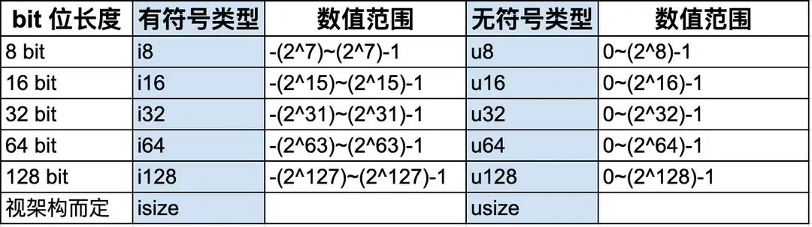
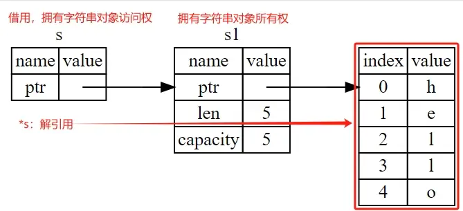
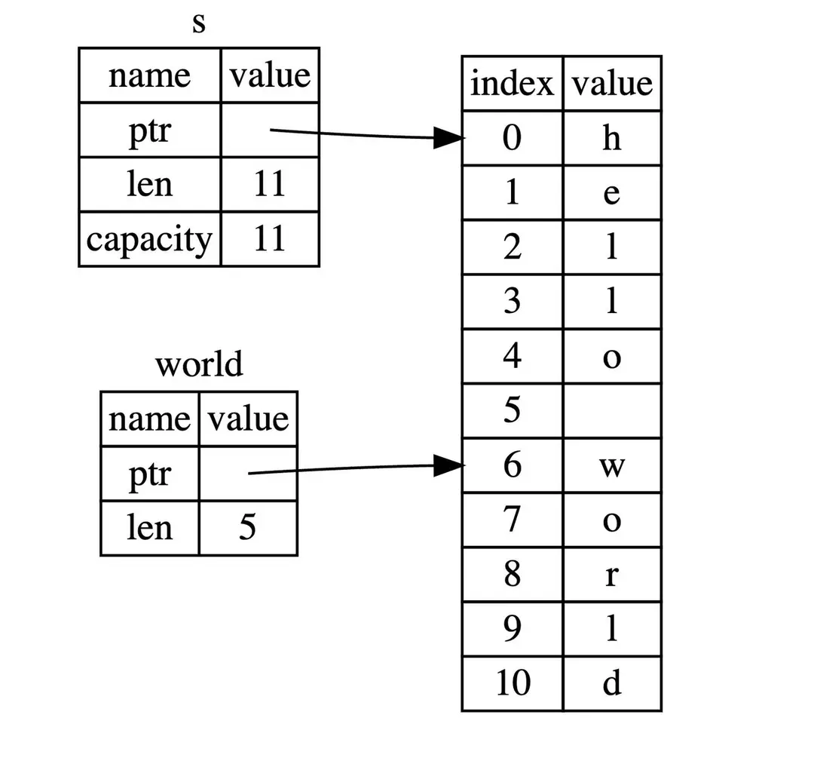
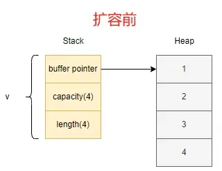

# 背景与起源

Rust 由 Graydon Hoare 于 2010 年创建，它的设计初衷是为了满足系统级编程的需求，并弥补 C++ 等语言的不足。在 Rust 的成长过程中，吸收了众多前辈语言的优点，同时摒弃了它们的一些痛点，使得 Rust 在系统编程领域脱颖而出。

Rust 语言以其强大的内存安全性、零成本抽象、并发性和不可变性而闻名。其独特的所有权系统使得程序员能够在不牺牲性能的前提下编写安全、并发的代码。这使得 Rust 在编写操作系统、嵌入式系统、网络服务以及特别是区块链领域表现出色。

# 变量

Rust 中的变量可以分为可变变量和不可变变量，通俗来说，就是变量的值是否允许修改，如果在内存中给变量分配完值之后，可以根据需要来修改这个值，那它就是可变变量，反之，不允许这个值再发生变更，那就是不可变变量。前者很容易理解，变量的值在不同场景下会发生变化，它为编程提供了灵活性；后者，也有存在的道理，通过不可变的限制，提供了编程的安全性，特别是在多线程环境下，也减少了一些运行时检查，在一定程度上提升运行性能。

> 注意：这里提到的是否可变指的是变量的值，而非变量的数据类型。

场景：

举个简单的例子，假如有个叫 Ferris 的同学，从它出生起，身份证号就是不可变的，伴随 Ferris 的一生（不可变变量在其整个生命周期中都是不可变的），因为不可变，所以在有些场景下非常有用，比如可以在全国公安系统中准确的定位到一个人；但是，像家庭住址、性别（Nothing is impossible）、联系方式等这些，却有可能发生变化，这些变化对 Ferris 来说也许是非常有必要的。

> 注：Ferris 是 Rust 社区的吉祥物，就是那个被煮熟的螃蟹🦀🙈

我们分别定义 2 个不同类型的变量，并尝试修改对应的值。

```rs
fn main() {
    // x 为可变变量，mut 即 mutable 的意思，该修饰符修饰的变量允许改变
    let mut x = 1;
    println!("x = {}", x);
    x = 2;
    println!("x = {}", x);

    // y 为不可变变量，如果没有指定 mut，则 Rust 默认为不可变
    let y = 3;
    println!("y = {}", y);
    // 对不可变变量 y 重新赋值，Rust 编译器会给出 cannot assign twice to immutable variable y 的错误提示
    y = 4;
    println!("y = {}", y);
}
```

## 变量的解构

变量解构是一种将复合数据类型（如元组、结构体、枚举等）中的值分解为单独变量的过程。它可以方便地从复杂的数据结构中提取出需要的值，并以更简洁的方式进行操作。通过这种方式，可以更好的控制数据的可见性，也使得代码更加优雅。变量解构通俗来讲就是已知原有的结构，解开该结构。它并不是 Rust 独有的特性，Python、JavaScript、Solidity 等许多编程语言也都有。

我们可以通过如下的方式，把水果篮里的香蕉、菠萝、榴莲放在 a、b、c 三个不同的盘子里，或者换一种方式，只拿香蕉和菠萝。

```rs
// 第一种放法
let (a, b, c) = ("Banana", "pineapple", "durian");

// 第二种放法
let (e, d, _) = ("Banana", "pineapple", "durian");
```

# 数值类型

Rust 基本数据类型中最常用的数值类型：有符号整数 (i8, i16, i32, i64, isize)、无符号整数 (u8, u16, u32, u64, usize) 、浮点数 (f32, f64)。整数是 没有小数部分的数字，具体有如下几种类型：



表示方式为：

- 有无符号 + 类型大小（位数）。i 是英文单词 integer 的首字母，代表有符号类型，包含负整数、0 和正整数，与之相反的是 u，代表无符号 unsigned 类型，包含 0 和正整数。
- Rust 默认的整数类型是 i32，即用 32 个 bit 位表示有符号的整数。
- 浮点类型数字：是带有小数点的数字，在 Rust 中浮点类型数字也有两种基本类型：f32 和 f64，分别为 32 位和 64 位大小。默认浮点类型是 f64。

我们在接下来看下数值的定义及表示方式。

```rs
// 这里 a 为默认的 i32 类型
let a = 1;
// 可以指定也可以指定为具体的整数类型
let b: u32 = 1;

// 这里 c 为默认的 f64 类型
let c = 1.0;
// 也可以指定为具体的浮点数类型
let d: f32 = 1.0;

// Rust 中可以方便的使用不同进制来表示数值，总有一款适合你
let x: i32 = 100_000_000;
let y: i32 = 0xffab;
let z: i32 = 0o77;
let m: i32 = 0b1111_0000;
let n: u8 = b'A';
println!("x = {}, y = {}, z = {}, m = {}, n = {}", x, y, z, m, n);
```

# 字符类型与布尔类型

字符类型是用 char 类型表示的，占用 4 个字节的空间，可以表示 Unicode 字符集中的任何字符，包括 ASCII 字符、各种符号、各种语言的文字，甚至是表情符号。通过单引号'可以创建一个 char 类型的值。例如 let a:char = '🦀';

布尔类型有两种值：true 和 false，占用内存的大小为 1 个字节。

注意：这里是介绍的是字符（用单引号''表示)，不是字符串 (用双引号""表示)，在 Rust 中，字符串类型的长度取决于使用的编码集，默认情况下，Rust 使用 UTF-8 编码，一个字符占用 1～4 个字节，而 char 类型占用 4 个字节的存储空间，即使有些字符在特定编码集下只需要 1～3 个字节表示，Rust 也会将其扩展为 4 个字节。这样做的好处是：

● 保证所有 char 值在内存中占用固定大小，有利于内存对齐和访问效率。

● 避免编码转换开销，直接使用 4 字节值可以高效处理字符。

● 足够表示 Unicode 标量值所需的全部码位，确保未来的兼容性。

```rs
// 英文字符
let c = 'z';
// 数学符号
let z = 'ℤ';
// 中文字符
let g = '国';
// emoji 表情
let ferris = '🦀';

// 布尔类型
let m = true;
```

# 语句，表达式，单元类型

语句（Statements）是 Rust 中的执行单位，它们执行一些操作但不返回值，以分号;结尾。

表达式（Expressions）是 Rust 中的计算单位，它们计算并返回一个值，所以表达式可以用作赋值。常见的表达式有函数调用、宏调用、用大括号创建的代码块等。

单元类型：是 Rust 中一个特殊的返回值类型，意味着函数或表达式没有返回值，类似于其他语言中的 void 的返回类型。用符号 () 来表示。

> 小技巧：区分语句和表达式的一个简单方法就是有无分号;，有的话就是语句，执行操作但不返回结果；没有的话就是表达式，执行计算并返回结果。虽然这种方式在有些情况下不成立，但现阶段足以让我们应对绝大数场景。

```rs
fn main() {
    // 语句，使用 let 关键字创建变量并绑定一个值
    let a = 1;

    // 语句不返回值，所以不能把语句 (let a = 1) 绑定给变量 b，下面代码会编译失败
    let b = (let a = 1);

    // 表达式，返回值是 x + 1
    let y = {
        let x = 3;
        x + 1
    };

    println!("The value of y is: {}", y); // y = 4
}
```

## 单元类型的例子

单元类型 `()` 在 Rust 中非常常见，以下是一些典型的例子：

### 1. 函数返回单元类型

```rs
// 没有显式返回值的函数，默认返回单元类型 ()
fn greet(name: &str) {
    println!("Hello, {}!", name);
    // 这里没有 return 语句，函数隐式返回 ()
}

// 显式返回单元类型
fn do_nothing() -> () {
    println!("I do nothing");
    () // 显式返回单元类型
}

fn main() {
    let result1 = greet("Ferris"); // result1 的类型是 ()
    let result2 = do_nothing();    // result2 的类型是 ()

    // 可以显式指定单元类型
    let unit_value: () = ();
    println!("Unit value: {:?}", unit_value); // 输出：Unit value: ()
}
```

### 2. if 语句返回单元类型

```rs
fn main() {
    let condition = true;

    // if 语句的每个分支都返回单元类型
    let result = if condition {
        println!("Condition is true");
        // 这里没有分号，返回 ()
    } else {
        println!("Condition is false");
        // 这里没有分号，返回 ()
    };

    // result 的类型是 ()
    println!("Result type: {:?}", result);
}
```

### 3. 循环返回单元类型

```rs
fn main() {
    let mut counter = 0;

    // loop 循环默认返回单元类型
    let loop_result = loop {
        counter += 1;
        if counter >= 3 {
            break; // break 不返回值，所以整个循环返回 ()
        }
    };

    // while 循环也返回单元类型
    let while_result = while counter < 5 {
        counter += 1;
        // 没有返回值，返回 ()
    };

    // for 循环同样返回单元类型
    let for_result = for i in 1..=3 {
        println!("Count: {}", i);
        // 没有返回值，返回 ()
    };

    println!("All loops return unit type: {:?}", loop_result);
}
```

### 4. 代码块返回单元类型

```rs
fn main() {
    // 代码块以分号结尾，返回单元类型
    let block_result = {
        let x = 5;
        let y = 10;
        println!("x = {}, y = {}", x, y);
        // 这里没有分号，但 println! 宏返回 ()
    };

    // 显式返回单元类型的代码块
    let explicit_unit = {
        let _unused = 42;
        () // 显式返回单元类型
    };

    println!("Block results: {:?}, {:?}", block_result, explicit_unit);
}
```

### 5. 结构体方法返回单元类型

```rs
struct Person {
    name: String,
    age: u32,
}

impl Person {
    // 方法不返回值，返回单元类型
    fn introduce(&self) {
        println!("Hi, I'm {} and I'm {} years old", self.name, self.age);
    }

    // 显式指定返回单元类型
    fn celebrate_birthday(&mut self) -> () {
        self.age += 1;
        println!("Happy birthday! Now I'm {} years old", self.age);
    }
}

fn main() {
    let mut person = Person {
        name: String::from("Ferris"),
        age: 25,
    };

    let intro_result = person.introduce(); // 返回 ()
    let birthday_result = person.celebrate_birthday(); // 返回 ()

    println!("Method results: {:?}, {:?}", intro_result, birthday_result);
}
```

### 6. 错误处理中的单元类型

```rs
use std::fs;

fn main() -> Result<(), std::io::Error> {
    // 创建文件，成功时返回单元类型
    fs::write("test.txt", "Hello, Rust!")?;

    // 删除文件，成功时返回单元类型
    fs::remove_file("test.txt")?;

    Ok(()) // 显式返回单元类型
}
```

这些例子展示了单元类型在 Rust 中的广泛应用。单元类型虽然不携带任何数据，但在类型系统中起着重要作用，确保类型安全和代码的清晰性。

Rust 为什么要设计没有任何返回值的单元类型 () ?

Rust 是一门静态类型语言，它在编译时需要确定每个函数的返回类型。

当函数体中没有返回语句或表达式时，编译器无法确定函数的返回类型应该是什么。为了解决这个问题，Rust 引入了单元类型 () 作为一种特殊的类型，表示没有返回值的函数。类似于其他语言中的 void 类型，通常用于打印消息、写入文件等一些不需要返回值的操作。

# 函数

函数是个很常见的概念，它是一段可重复使用的代码块，用于执行特定的任务或完成特定的操作。函数接受输入参数（可选），执行一系列操作，并返回一个值（可选）。

> 注意：Rust 代码中的函数和变量名使用 snake_case 规范风格。

现在我们来看下函数的各个组成部分。需要注意的是，函数的参数需要显式的标注类型，不仅有助于提高代码的可读性，也有助于 Rust 提供更强的类型安全性，帮助编译器在类型不匹配时发现错误，提供有用的错误信息。

```rs
// fn 为声明函数的关键字
// unsafe_add() 是函数名，函数的命名要遵循 snake_case 的规范，同时要见名知意，提高代码的可读性
// i 和 j 是入参，并且需要显式指定参数类型
// --> i32 表明出参也是 i32 类型
fn unsafe_add(i: i32, j: i32) -> i32 {
   // 表达式形式，所以函数会在计算求和后返回该值
   i + j
}
```

我们在前面章节了解到整数相加可能会溢出，但这里并没有特殊处理，所以 unsafe_add 更容易提醒开发者，这个相加是不安全的，要注意啦~

## 发散函数（Diverging Functions）

指的是永远不会返回的函数，甚至连默认的单元类型 () 返回值都没有，这些函数通常用！类型来标注。通常用于处理错误或不可恢复的情况，并通过终止程序的执行来表达这种状态。

```rs
// 发散函数的例子

// 1. 使用 panic! 宏的函数
fn panic_function() -> ! {
    panic!("This function will never return normally");
}

// 2. 无限循环函数
fn infinite_loop() -> ! {
    loop {
        println!("This will run forever");
        // 没有 break 语句，所以永远不会退出
    }
}

// 3. 使用 unreachable! 宏的函数
fn unreachable_function(x: i32) -> ! {
    if x > 0 {
        panic!("Positive number encountered");
    } else if x < 0 {
        panic!("Negative number encountered");
    } else {
        unreachable!("This code should never be reached");
    }
}

// 4. 递归调用自身的函数
fn recursive_panic(n: u32) -> ! {
    if n == 0 {
        panic!("Reached the end");
    } else {
        println!("Countdown: {}", n);
        recursive_panic(n - 1); // 递归调用，最终会 panic
    }
}

// 5. 在 match 语句中使用发散函数
fn match_with_diverging(x: Option<i32>) -> i32 {
    match x {
        Some(value) => value,
        None => {
            // 这里调用发散函数，编译器知道这个分支永远不会返回
            panic!("Expected Some value, got None");
        }
    }
}

// 6. 使用 std::process::exit 的函数
use std::process;

fn exit_program() -> ! {
    println!("Exiting program...");
    process::exit(1); // 程序立即退出，永远不会返回
}

fn main() {
    // 演示发散函数的使用

    // 注意：以下代码会终止程序，所以注释掉
    // panic_function();
    // infinite_loop();
    // unreachable_function(0);
    // recursive_panic(5);
    // exit_program();

    // 演示在 match 中的使用
    let result = match_with_diverging(Some(42));
    println!("Result: {}", result);

    // 这个会 panic
    // let result = match_with_diverging(None);

    println!("Program completed successfully");
}
```

### 发散函数的特点

1. **返回类型为 `!`**：`!` 是 Rust 中的"never"类型，表示函数永远不会正常返回
2. **程序终止**：发散函数通常会导致程序 panic 或退出
3. **类型安全**：编译器知道这些函数不会返回，因此可以在类型检查中利用这个信息
4. **常见用途**：
   - 错误处理：当遇到不可恢复的错误时
   - 无限循环：如事件循环、服务器主循环
   - 程序退出：清理资源后退出程序

### 发散函数在类型系统中的作用

```rs
fn example_with_diverging() {
    let x = if true {
        42
    } else {
        // 编译器知道这个分支永远不会执行，因为条件总是 true
        // 但即使如此，这个分支的返回类型必须与 if 分支匹配
        panic!("This will never happen");
    };

    println!("x = {}", x); // x 的类型是 i32，不是 !
}
```

发散函数是 Rust 类型系统的重要组成部分，它们帮助编译器进行更精确的类型推断和错误检查。

# 栈内存和堆内存

栈内存存储的数据主要为大小固定的基础数据类型，分配和释放速度很快；它以放入值的顺序存储值并以相反顺序取出值。这也被称作 后进先出（last in, first out）。

前面介绍过 Rust 的基础类型：i32、char、f64、bool 等，它们都是已知大小的，存储在栈内存中

堆内存存储那些大小在运行时动态变化的数据结构，允许更灵活的数据共享和动态分配；当向堆放入数据时，内存分配器（memory allocator）在堆的某处找到一块足够大的空位，把它标记为已使用，并返回一个表示该位置地址的指针（pointer）。总的来说，堆、栈内存并无优劣之分，只是面向的场景不同而已。

比如动态字符串（String 类型）：大小可变的字符集合，这个类型允许程序在运行时动态的管理堆内存上的字符串数据，比如分配、增长和修改字符串内容，所以能够存储在编译时未知大小的内容。

通过下面的代码，我们看下动态字符串的创建。

```rs
use std::io;
fn main() {
     // 创建一个可变的字符串变量来存储用户输入
    let mut input: String = String::new();
    println!("请输入您的名字：");
    // 读取用户输入并将其存储在 input 变量中
    io::stdin()
        .read_line(&mut input)
        .expect("无法读取输入");
    // 打印用户输入的字符串
    println!("您的名字是：{}", input);
}
```

# 所有权

Rust 中每个值都有一个唯一的所有者 owner（如上节代码 let s1 = String::from("hello");中，变量 s1 是 hello 这个值的所有者），所有者拥有这个值的所有权，负责管理内存资源的分配和释放。Rust 通过所有权机制规定内存管理的方式，确保程序在运行时不发生数据竞争、悬垂指针等内存安全问题。让 Rust 无需垃圾回收器（garbage collector）即可保证内存安全。

所有权三原则：

1. Rust 中每一个值都被一个变量所拥有，该变量被称为值的所有者；

2.一个值同时只能被一个变量所拥有，或者说一个值只能拥有一个所有者；

3.当所有者 (变量) 离开作用域范围时，这个值将被 drop (丢弃)。

我们在下面的代码中展示所有权的分配、修改。

```rs
// 变量 s1 拥有字符串 hello 的所有权
let mut s1:String = String::from("hello");

// 变量 s1 可以修改该字符串
s1.push_str(", hackquest."); // push_str() 在字符串后追加字面值
```

所有权可以转移给函数，在移动期间，所有者的堆栈值将会被复制到函数调用的参数堆栈中。

```rs
struct Foo {
    x: i32,
}

fn do_something(f: Foo) {
    println!("{}", f.x);
    // f 在这里被 dropped 释放
}

fn main() {
    let foo = Foo { x: 42 };
    // foo 被移交至 do_something
    do_something(foo);
    // 此后 foo 便无法再被使用
}
```

当然，也可以从函数中获取所有权：

```rs
// 函数返回所有权
fn create_string() -> String {
    let s = String::from("hello");
    s // 返回所有权，s 的所有权转移给调用者
}

fn main() {
    // 从函数获取所有权
    let s1 = create_string(); // s1 获得了从函数返回的字符串的所有权
    println!("从函数获取的字符串：{}", s1);

    // 函数也可以返回结构体的所有权
    let person = create_person();
    println!("从函数获取的人：{} 岁", person.age);
}

struct Person {
    name: String,
    age: u32,
}

fn create_person() -> Person {
    Person {
        name: String::from("Ferris"),
        age: 25,
    } // 返回结构体的所有权
}
```

#### 所有权转移的完整流程

```rs
fn main() {
    // 1. 创建数据并拥有所有权
    let original = String::from("original data");

    // 2. 将所有权转移给函数
    let returned = take_and_return(original);

    // 3. 重新获得所有权
    println!("重新获得的数据：{}", returned);

    // 注意：original 在这里已经不能再使用了
    // println!("{}", original); // 编译错误：original 已经被移动
}

fn take_and_return(s: String) -> String {
    println!("函数内部接收到的数据：{}", s);
    s // 返回所有权，转移给调用者
}
```

#### 函数返回所有权的常见场景

```rs
// 场景 1：工厂函数 - 创建并返回新实例
fn create_counter() -> Counter {
    Counter { count: 0 }
}

// 场景 2：转换函数 - 转换数据并返回新所有权
fn process_string(s: String) -> String {
    let mut processed = s;
    processed.push_str(" (processed)");
    processed
}

// 场景 3：构建器模式 - 逐步构建复杂对象
fn build_person(name: String, age: u32) -> Person {
    Person { name, age }
}

struct Counter {
    count: u32,
}

fn main() {
    // 使用工厂函数
    let counter = create_counter();

    // 使用转换函数
    let original = String::from("hello");
    let processed = process_string(original);

    // 使用构建器
    let person = build_person(String::from("Alice"), 30);

    println!("计数器：{:?}", counter);
    println!("处理后的字符串：{}", processed);
    println!("构建的人：{} 岁", person.age);
}
```

# 借用

借用 (Borrowing) ：是指通过引用来获得数据的访问权，而不是所有权，用符号&表示。借用使得可以在不转移所有权的情况下，让多个部分同时访问相同的数据。Rust 的借用分为可变借用（mutable borrowing）和不可变借用（immutable borrowing）两种形式。

解引用：是借用的一个重要操作，允许通过引用获取到被引用值的实际内容，简单来说，就是获取到借用的对象的值。用符号\*表示。

## 不可变借用（Immutable Borrowing）

不可变借用允许你读取数据，但不能修改它。可以同时有多个不可变借用。

```rs
fn main() {
    let s1 = String::from("hello");

    // 不可变借用 - 使用 & 符号
    let len = calculate_length(&s1);

    println!("'{}' 的长度是 {}", s1, len);

    // 可以同时有多个不可变借用
    let reference1 = &s1;
    let reference2 = &s1;
    let reference3 = &s1;

    println!("{} {} {}", reference1, reference2, reference3);

    // 原变量仍然可以使用
    println!("原字符串：{}", s1);
}

fn calculate_length(s: &String) -> usize {
    s.len() // 这里只是读取字符串长度，不修改
}
```

## 可变借用（Mutable Borrowing）

可变借用允许你读取和修改数据，但同一时间只能有一个可变借用。

```rs
fn main() {
    let mut s1 = String::from("hello");

    // 可变借用 - 使用 &mut 符号
    change_string(&mut s1);

    println!("修改后的字符串：{}", s1);

    // 可变借用的限制：同一时间只能有一个可变借用
    let mut s2 = String::from("world");

    // 第一个可变借用
    let ref1 = &mut s2;
    ref1.push_str("!"); // 可以修改字符串

    // 可变借用既可以读取也可以修改
    println!("修改后的字符串：{}", ref1);

    // 下面的代码会编译错误，因为已经有可变借用了
    // let ref2 = &mut s2; // 错误：不能同时有多个可变借用
    // let ref3 = &s2;     // 错误：不能同时有可变借用和不可变借用
}

fn change_string(s: &mut String) {
    s.push_str(", world!"); // 修改字符串
}

// 更详细的例子展示可变借用的能力
fn demonstrate_mutable_borrowing() {
    let mut text = String::from("Hello");

    println!("原始变量 text: {}", text);

    // 可变借用
    let mut_ref = &mut text;

    // 可变借用可以读取数据
    println!("通过借用读取：{}", mut_ref);

    // 可变借用可以修改数据
    mut_ref.push_str(" Rust!");
    println!("通过借用修改后：{}", mut_ref);

    // 可变借用还可以调用修改方法
    mut_ref.clear();
    mut_ref.push_str("New content");
    println!("通过借用最终内容：{}", mut_ref);

    // 借用结束后，原始变量也发生了变化
    println!("借用结束后，原始变量 text: {}", text);
}

// 另一个例子：展示可变借用直接修改原始数据
fn show_original_data_change() {
    let mut numbers = vec![1, 2, 3];

    println!("原始数据：{:?}", numbers);

    {
        // 创建可变借用
        let mut_ref = &mut numbers;

        // 通过借用修改数据
        mut_ref.push(4);
        mut_ref[0] = 10;

        println!("借用期间的数据：{:?}", mut_ref);
    } // 借用在这里结束

    // 借用结束后，原始数据已经被修改
    println!("借用结束后的原始数据：{:?}", numbers);

    // 可以继续使用原始变量
    numbers.push(5);
    println!("继续使用原始变量：{:?}", numbers);
}
```

## 借用规则

Rust 的借用检查器强制执行以下规则：

```rs
fn main() {
    let mut data = vec![1, 2, 3, 4, 5];

    // 规则 1：在任意给定时间，要么只能有一个可变引用，要么只能有任意数量的不可变引用
    let reference1 = &data;  // 不可变借用
    let reference2 = &data;  // 不可变借用
    let reference3 = &data;  // 不可变借用

    println!("{} {} {}", reference1[0], reference2[1], reference3[2]);

    // 规则 2：引用必须总是有效的（不能有悬垂引用）
    // 下面的代码会编译错误
    // let reference_to_nothing = dangle();

    // 规则 3：可变借用和不可变借用不能同时存在
    // 下面的代码会编译错误
    // let mut_ref = &mut data;  // 可变借用
    // println!("{}", reference1[0]); // 错误：同时存在可变和不可变借用
}

// 这个函数会产生悬垂引用，编译会失败
// fn dangle() -> &String {
//     let s = String::from("hello");
//     &s // 返回对局部变量的引用，s 在函数结束时会被丢弃
// }
```

## 借用在不同场景中的应用

### 1. 函数参数中的借用

```rs
fn main() {
    let mut numbers = vec![1, 2, 3, 4, 5];

    // 不可变借用作为参数
    print_vector(&numbers);

    // 可变借用作为参数
    add_element(&mut numbers, 6);

    print_vector(&numbers);
}

fn print_vector(v: &Vec<i32>) {
    println!("向量内容：{:?}", v);
}

fn add_element(v: &mut Vec<i32>, element: i32) {
    v.push(element);
}
```

### 2. 结构体中的借用

```rs
struct Book {
    title: String,
    author: String,
    year: u32,
}

fn main() {
    let mut book = Book {
        title: String::from("Rust Programming"),
        author: String::from("Ferris"),
        year: 2023,
    };

    // 不可变借用
    print_book_info(&book);

    // 可变借用
    update_book_year(&mut book, 2024);

    print_book_info(&book);
}

fn print_book_info(book: &Book) {
    println!("书名：{}, 作者：{}, 年份：{}", book.title, book.author, book.year);
}

fn update_book_year(book: &mut Book, new_year: u32) {
    book.year = new_year;
}
```

### 3. 切片借用

```rs
fn main() {
    let mut numbers = [1, 2, 3, 4, 5, 6, 7, 8, 9, 10];

    // 不可变切片借用
    let first_half = &numbers[0..5];
    let second_half = &numbers[5..10];

    println!("前半部分：{:?}", first_half);
    println!("后半部分：{:?}", second_half);

    // 可变切片借用
    let mutable_slice = &mut numbers[2..7];
    for num in mutable_slice.iter_mut() {
        *num *= 2; // 解引用并修改值
    }

    println!("修改后的数组：{:?}", numbers);
}
```

### 4. 借用检查器的智能分析

```rs
fn main() {
    let mut data = vec![1, 2, 3, 4, 5];

    // 借用检查器能够分析作用域，允许这样的代码
    {
        let reference = &data; // 不可变借用
        println!("长度：{}", reference.len());
    } // reference 在这里离开作用域

    // 现在可以创建可变借用
    let mutable_ref = &mut data;
    mutable_ref.push(6);

    println!("修改后的数据：{:?}", data);
}
```

## 解引用操作

解引用操作使用 `*` 符号，它允许我们通过引用获取被引用值的实际内容。虽然可变借用可以直接修改原始数据，但解引用在某些场景下是必要的。

### 为什么需要解引用

```rs
fn main() {
    let mut x = 5;
    let y = &mut x; // 可变借用

    // 情况 1：算术运算需要解引用
    *y += 1; // 通过解引用进行算术运算
    *y = *y * 2; // 通过解引用进行乘法运算

    // 情况 2：比较操作需要解引用
    if *y > 10 {
        println!("y 大于 10");
    }

    // 情况 3：函数调用可能需要解引用
    let result = some_function(*y); // 传递值而不是引用

    println!("x = {}", x); // 输出：x = 12
}

fn some_function(value: i32) -> i32 {
    value * 2
}
```

### 可变借用与算术运算的关系

```rs
fn main() {
    let mut x = 5;
    let y = &mut x; // 可变借用

    // 错误：不能直接对引用进行算术运算
    // y += 1; // 编译错误：不能对 &mut i32 进行 += 操作

    // 正确：通过解引用进行算术运算
    *y += 1; // 解引用后得到 i32，可以进行算术运算

    // 错误：不能直接比较引用
    // if y > 10 { } // 编译错误：不能比较 &mut i32 和 i32

    // 正确：通过解引用进行比较
    if *y > 10 {
        println!("y 大于 10");
    }

    println!("x = {}", x);
}
```

### 解引用 vs 可变借用直接修改

```rs
fn main() {
    let mut numbers = vec![1, 2, 3, 4, 5];

    // 方法 1：使用可变借用的方法直接修改
    let mut_ref = &mut numbers;
    mut_ref.push(6); // 直接调用方法，不需要解引用
    mut_ref[0] = 10; // 直接索引访问，不需要解引用

    // 方法 2：使用解引用进行复杂操作
    let mut_ref = &mut numbers;
    *&mut mut_ref[1] = 20; // 解引用进行赋值
    *&mut mut_ref[2] += 5; // 解引用进行算术运算

    println!("numbers: {:?}", numbers);
}
```

### 解引用的不同场景

```rs
fn main() {
    let mut value = 42;
    let ref_value = &mut value;

    // 场景 1：算术运算
    *ref_value += 8;
    *ref_value *= 2;
    *ref_value -= 10;

    // 场景 2：比较操作
    if *ref_value > 50 {
        println!("值大于 50");
    }

    // 场景 3：函数参数传递
    let result = calculate_square(*ref_value);

    // 场景 4：模式匹配
    match *ref_value {
        0..=50 => println!("值在 0-50 之间"),
        51..=100 => println!("值在 51-100 之间"),
        _ => println!("值大于 100"),
    }

    println!("最终值：{}", value);
}

fn calculate_square(x: i32) -> i32 {
    x * x
}
```

### 解引用在迭代器中的应用

```rs
fn main() {
    let mut numbers = vec![1, 2, 3, 4, 5];

    // 使用 iter_mut() 获取可变引用迭代器
    for num in numbers.iter_mut() {
        *num *= 2; // 必须解引用才能修改值
    }

    println!("修改后的数字：{:?}", numbers);

    // 使用 enumerate() 获取索引和可变引用
    for (index, num) in numbers.iter_mut().enumerate() {
        *num += index as i32; // 解引用进行算术运算
    }

    println!("最终数字：{:?}", numbers);
}
```

### 解引用在结构体中的应用

```rs
struct Point {
    x: i32,
    y: i32,
}

fn main() {
    let mut point = Point { x: 10, y: 20 };
    let point_ref = &mut point;

    // 访问结构体字段时不需要解引用
    point_ref.x = 15;
    point_ref.y = 25;

    // 但进行算术运算时需要解引用
    let x_ref = &mut point_ref.x;
    *x_ref += 5;

    let y_ref = &mut point_ref.y;
    *y_ref *= 2;

    println!("点坐标：({}, {})", point.x, point.y);
}
```

### 解引用的必要性总结

1. **算术运算**：`*ref += 1`、`*ref * 2` 等操作必须解引用（因为算术运算符需要值类型）
2. **比较操作**：`*ref > 10`、`*ref == 5` 等比较必须解引用（因为比较运算符需要值类型）
3. **函数参数**：传递值而不是引用时需要解引用
4. **模式匹配**：在 match 语句中使用值需要解引用
5. **迭代器操作**：`for num in iter_mut()` 中修改值需要解引用
6. **复杂表达式**：在复杂表达式中使用值时需要解引用

### 类型系统角度理解解引用

```rs
fn main() {
    let mut x = 5;
    let y = &mut x; // y 的类型是 &mut i32

    // 算术运算符（如 +=）是为 i32 类型定义的，不是为 &mut i32 定义的
    // 所以需要解引用将 &mut i32 转换为 i32

    // 错误：类型不匹配
    // y += 1; // 类型：&mut i32 += i32（不匹配）

    // 正确：解引用后类型匹配
    *y += 1; // 类型：i32 += i32（匹配）

    // 同样，比较运算符也是为值类型定义的
    // if y > 10 { } // 类型：&mut i32 > i32（不匹配）
    if *y > 10 { } // 类型：i32 > i32（匹配）
}
```

### 自动解引用

Rust 在某些情况下会自动解引用：

```rs
fn main() {
    let x = 5;
    let ref_x = &x;

    // 自动解引用
    println!("x = {}", ref_x); // 等同于 println!("x = {}", *ref_x);

    // 方法调用时的自动解引用
    let text = String::from("hello");
    let ref_text = &text;
    println!("长度：{}", ref_text.len()); // 自动解引用调用方法
}
```

解引用是 Rust 中处理引用的重要操作，它让我们能够：

- 获取被引用值的实际内容
- 进行算术运算和比较操作
- 在需要值的场景中使用引用
- 在迭代器中修改集合元素

借用是 Rust 内存安全的核心机制之一，它通过编译时检查确保程序不会出现数据竞争和悬垂引用等内存安全问题。

通过一下的图示，我们会发现借用其实就是存储了字符串对象的内存地址指针，所以用更宽泛的概念来说，借用也是一种引用。



# 生命周期

Rust 中的每一个引用都有其生命周期（lifetime），也就是引用保持有效的作用域。在大多数时候，我们无需手动的声明生命周期，因为编译器可以自动进行推导，但当多个生命周期存在，如同上节的 longest 函数：fn longest(x: &str, y: &str) -> &str {……}，入参有 2 个不同引用，出参也会根据函数体逻辑指向不同的引用，此时编译器无法进行引用的生命周期分析，就需要我们手动标明不同引用之间的生命周期关系，也就是生命周期标注。

生命周期标注并不改变任何引用的生命周期的长短。它只是描述了多个引用生命周期相互的关系，便于编译器进行引用的分析，但不影响其生命周期。它的目的是避免悬垂引用，防止程序引用了本不该引用的数据。

生命周期标注的语法：生命周期参数名称必须以撇号'开头，其名称通常全是小写，类似于泛型其名称非常短。'a 是默认使用的名称。生命周期参数标注位于引用的 & 之后，并有一个空格来将引用类型与生命周期标注分隔开。

对于函数的参数和返回值中存在多个引用，需要手动去标记生命周期。

```rs
fn longest<'a>(x: &'a str, y: &'a str) -> &'a str {
    if x.len() > y.len() {
        x
    } else {
        y
    }
}
```

参数 x 和 y 的生命周期标注都是'a，至于 'a 究竟是多久我们并不需要关心，只需要知道 'a 代表的是变量 x 和 y 生命周期相同（重叠）的那部分，即 x 和 y 生命周期中最小的那个范围。而返回值也是通过 'a 进行标注的，说明了返回值的生命周期与变量 x 或 y 中最小的那个一致。我们通过 FAQ 来看下具体的使用例子。

longest 函数是如何处理具有不同生命周期的引用？

如下的代码展示了 string1 和 string2 这两个不同生命周期的变量，前者的生命周期位于外部的{}中，而后者的生命周期位于内部的{}中，所以'a 代表的生命周期范围是两者中较小的那个，即内部的 {}，此时返回值 result 的生命周期也是属于内部的 {}，即返回值能够保证在 string1 和 string2 中较短的那个生命周期结束前有效，此时不会发生悬垂引用，编译通过。

```rs
fn main() {
    let string1 = String::from("abcdefghijklmnopqrstuvwxyz");
    {
        let string2 = String::from("123456789");
        let result = longest(string1.as_str(), string2.as_str());
        println!("The longest string is {}", result);
    }
}
```

接下来，让我们尝试另外一个例子，该例子揭示了 result 的引用的生命周期必须是两个参数中较短的那个。

```rs
fn main() {
    let string1 = String::from("abcdefghijklmnopqrstuvwxyz");
    let result;
    {
        let string2 = String::from("123456789");
        result = longest(string1.as_str(), string2.as_str());
    }
    println!("The longest string is {}", result);
}
```

此时 'a 代表的生命周期范围依旧是变量 string1 和 string2 中最小的那个，即内部的{}，但返回值 result 的生命周期范围却是外部的{}，而不是内部的{}，也就意味着 result 可能会引用一个无效的值，因此编译失败。

> 注意：通过人为观察 result 的引用应该为 string1，这样返回值 result 和 string1 的作用域是一致的，理论上是应该编译通过的。但是，Rust 的编译器会采用保守的策略，我们通过生命周期标注告诉 Rust，longest 函数返回值的生命周期是传入参数中较小的那个变量的生命周期，因此借用检查器不允许上述代码，因为可能存在无效引用。

## 生命周期注解

生命周期注解是 Rust 用来确保引用有效性的重要机制。它告诉编译器引用应该保持有效多长时间。

#### 生命周期注解的语法

生命周期注解使用 `'a`、`'b` 等标识符，其中 `'a` 是最常用的。

```rs
// 基本语法：<'a> 声明生命周期参数
fn longest<'a>(x: &'a str, y: &'a str) -> &'a str {
    if x.len() > y.len() {
        x
    } else {
        y
    }
}
```

#### 生命周期注解的含义

在上面的例子中：

- `<'a>` 声明了一个生命周期参数 `'a`
- `x: &'a str` 表示参数 `x` 的生命周期是 `'a`
- `y: &'a str` 表示参数 `y` 的生命周期也是 `'a`
- `-> &'a str` 表示返回值的生命周期也是 `'a`

这意味着：**返回的引用必须与输入参数中生命周期较短的那个保持一致**。

#### 详细解释生命周期注解

```rs
fn main() {
    let string1 = String::from("abcd");     // 生命周期开始
    let string2 = "xyz";                    // 生命周期开始

    let result = longest(&string1, string2); // 调用函数
    println!("最长的字符串是 {}", result);

    // 这里 string1 和 string2 仍然有效，所以 result 也有效
} // 生命周期结束

// 生命周期注解告诉编译器：
// 1. 参数 x 和 y 必须至少与返回值一样长
// 2. 返回值不能比任何一个参数活得更久
fn longest<'a>(x: &'a str, y: &'a str) -> &'a str {
    if x.len() > y.len() {
        x  // 返回 x 的引用
    } else {
        y  // 返回 y 的引用
    }
}
```

#### 为什么需要生命周期注解

```rs
// 没有生命周期注解的函数（编译错误）
fn longest_without_lifetime(x: &str, y: &str) -> &str {
    if x.len() > y.len() {
        x
    } else {
        y
    }
    // 编译器不知道返回的引用应该与哪个参数的生命周期一致
}

// 有生命周期注解的函数（正确）
fn longest_with_lifetime<'a>(x: &'a str, y: &'a str) -> &'a str {
    if x.len() > y.len() {
        x
    } else {
        y
    }
    // 编译器知道返回的引用与输入参数有相同的生命周期
}
```

#### 生命周期注解的实际应用

```rs
// 例子 1：结构体中的生命周期
struct ImportantExcerpt<'a> {
    part: &'a str, // 这个引用必须至少与结构体实例一样长
}

fn main() {
    let novel = String::from("Call me Ishmael. Some years ago...");
    let first_sentence = novel.split('.').next().unwrap();

    let i = ImportantExcerpt {
        part: first_sentence,
    };

    // i 的生命周期不能超过 novel
    println!("重要片段：{}", i.part);
}

// 例子 2：多个生命周期参数
fn longest_with_different_lifetimes<'a, 'b>(x: &'a str, y: &'b str) -> &'a str {
    // 这个函数总是返回 x，所以返回值的生命周期与 x 相同
    x
}

// 例子 3：生命周期省略规则
fn first_word(s: &str) -> &str {
    // 编译器可以自动推断生命周期，不需要显式注解
    let bytes = s.as_bytes();

    for (i, &item) in bytes.iter().enumerate() {
        if item == b' ' {
            return &s[0..i];
        }
    }

    &s[..]
}
```

#### 生命周期省略规则

Rust 编译器有一些规则可以自动推断生命周期，不需要显式注解：

1. **每个引用参数都有自己的生命周期参数**
2. **如果只有一个输入生命周期参数，那么它被赋给所有输出生命周期参数**
3. **如果有多个输入生命周期参数，但其中一个是 `&self` 或 `&mut self`，那么 `self` 的生命周期被赋给所有输出生命周期参数**

```rs
// 规则 1：每个参数都有自己的生命周期
fn foo<'a, 'b>(x: &'a i32, y: &'b i32) {}

// 规则 2：只有一个输入参数时
fn bar<'a>(x: &'a i32) -> &'a i32 { x }

// 规则 3：方法中的 self 参数
impl<'a> ImportantExcerpt<'a> {
    fn announce_and_return_part(&self, announcement: &str) -> &str {
        println!("注意：{}", announcement);
        self.part
    }
}
```

#### 什么是 self 参数

`self` 参数是 Rust 中方法（method）的特殊参数，它表示方法被调用的实例。`self` 参数让方法能够访问结构体实例的数据。

#### self 参数的使用场景

`self` 参数主要在以下场景中使用：

1. **结构体方法**：在 `impl` 块中定义的方法
2. **枚举方法**：在枚举的 `impl` 块中定义的方法
3. **特征方法**：在特征（trait）中定义的方法
4. **扩展方法**：为现有类型添加新方法

#### self 参数的不同形式

```rs
struct Person {
    name: String,
    age: u32,
}

impl Person {
    // 1. &self - 不可变借用，只读访问
    fn get_name(&self) -> &str {
        &self.name
    }

    // 2. &mut self - 可变借用，可以修改实例
    fn have_birthday(&mut self) {
        self.age += 1;
        println!("{} 现在 {} 岁了！", self.name, self.age);
    }

    // 3. self - 获取所有权，消耗实例
    fn consume(self) -> String {
        format!("{} 被消耗了", self.name)
    }
}

fn main() {
    let mut person = Person {
        name: String::from("Ferris"),
        age: 25,
    };

    // 使用 &self 方法
    println!("姓名：{}", person.get_name());

    // 使用 &mut self 方法
    person.have_birthday();

    // 使用 self 方法（注意：这会消耗 person）
    let message = person.consume();
    println!("{}", message);

    // 这里不能再使用 person，因为它已经被消耗了
    // println!("{}", person.name); // 编译错误
}
```

#### self 参数在生命周期中的作用

```rs
struct Book<'a> {
    title: &'a str,
    author: &'a str,
}

impl<'a> Book<'a> {
    // 当方法有 &self 参数时，返回值的生命周期与 self 相同
    fn get_title(&self) -> &str {
        self.title
    }

    // 多个参数时，返回值的生命周期与 self 相同
    fn get_info(&self, prefix: &str) -> &str {
        self.title // 返回 self.title，生命周期与 self 相同
    }

    // 可变借用方法
    fn update_title(&mut self, new_title: &'a str) {
        self.title = new_title;
    }
}

fn main() {
    let title = String::from("Rust Programming");
    let author = String::from("Ferris");

    let mut book = Book {
        title: &title,
        author: &author,
    };

    // 调用方法
    println!("书名：{}", book.get_title());
    println!("信息：{}", book.get_info("书名："));

    let new_title = "Advanced Rust";
    book.update_title(&new_title);
    println!("更新后的书名：{}", book.get_title());
}
```

#### self 参数与普通函数的区别

```rs
struct Counter {
    count: u32,
}

impl Counter {
    // 方法：使用 &self 参数
    fn increment(&mut self) {
        self.count += 1;
    }

    fn get_count(&self) -> u32 {
        self.count
    }
}

// 普通函数：需要显式传递实例
fn increment_counter(counter: &mut Counter) {
    counter.count += 1;
}

fn get_counter_count(counter: &Counter) -> u32 {
    counter.count
}

fn main() {
    let mut counter = Counter { count: 0 };

    // 使用方法（更简洁）
    counter.increment();
    println!("计数：{}", counter.get_count());

    // 使用普通函数（需要显式传递实例）
    increment_counter(&mut counter);
    println!("计数：{}", get_counter_count(&counter));
}
```

#### self 参数的生命周期规则

```rs
struct Data<'a> {
    content: &'a str,
}

impl<'a> Data<'a> {
    // 规则：当方法有 &self 参数时，返回值的生命周期与 self 相同
    fn get_content(&self) -> &str {
        self.content // 返回值的生命周期与 self 相同
    }

    // 多个参数时，返回值的生命周期与 self 相同
    fn combine_with(&self, other: &str) -> &str {
        self.content // 即使有其他参数，返回值仍与 self 相同
    }

    // 可变借用方法
    fn update_content(&mut self, new_content: &'a str) {
        self.content = new_content;
    }
}
```

#### self 参数在不同类型中的使用

```rs
// 1. 结构体方法
struct Rectangle {
    width: u32,
    height: u32,
}

impl Rectangle {
    // 使用 &self 的方法
    fn area(&self) -> u32 {
        self.width * self.height
    }

    // 使用 &mut self 的方法
    fn resize(&mut self, width: u32, height: u32) {
        self.width = width;
        self.height = height;
    }

    // 使用 self 的方法（消耗实例）
    fn into_square(self) -> Rectangle {
        let size = self.width.max(self.height);
        Rectangle { width: size, height: size }
    }
}

// 2. 枚举方法
enum Message {
    Quit,
    Move { x: i32, y: i32 },
    Write(String),
    ChangeColor(i32, i32, i32),
}

impl Message {
    fn call(&self) {
        match self {
            Message::Quit => println!("退出"),
            Message::Move { x, y } => println!("移动到 ({}, {})", x, y),
            Message::Write(text) => println!("写入：{}", text),
            Message::ChangeColor(r, g, b) => println!("改变颜色：RGB({}, {}, {})", r, g, b),
        }
    }
}

// 3. 特征方法
trait Drawable {
    fn draw(&self);
    fn get_position(&self) -> (i32, i32);
}

struct Circle {
    x: i32,
    y: i32,
    radius: u32,
}

impl Drawable for Circle {
    fn draw(&self) {
        println!("绘制圆形：位置 ({}, {}), 半径{}", self.x, self.y, self.radius);
    }

    fn get_position(&self) -> (i32, i32) {
        (self.x, self.y)
    }
}

// 4. 扩展方法（为现有类型添加方法）
trait StringExt {
    fn count_words(&self) -> usize;
    fn reverse(&self) -> String;
}

impl StringExt for String {
    fn count_words(&self) -> usize {
        self.split_whitespace().count()
    }

    fn reverse(&self) -> String {
        self.chars().rev().collect()
    }
}

fn main() {
    // 使用结构体方法
    let mut rect = Rectangle { width: 10, height: 20 };
    println!("面积：{}", rect.area());
    rect.resize(15, 25);
    println!("调整后面积：{}", rect.area());

    // 使用枚举方法
    let msg = Message::Write(String::from("Hello"));
    msg.call();

    // 使用特征方法
    let circle = Circle { x: 100, y: 200, radius: 50 };
    circle.draw();
    let pos = circle.get_position();
    println!("位置：{:?}", pos);

    // 使用扩展方法
    let text = String::from("Hello World");
    println!("单词数：{}", text.count_words());
    println!("反转：{}", text.reverse());
}
```

#### self 参数的重要性

1. **面向对象编程**：`self` 参数让 Rust 支持面向对象编程风格
2. **方法调用语法**：`instance.method()` 比 `function(instance)` 更自然
3. **生命周期管理**：`self` 参数帮助编译器推断返回值的生命周期
4. **所有权语义**：不同的 `self` 形式表达不同的所有权意图
   - `&self`：只读访问
   - `&mut self`：可修改访问
   - `self`：获取所有权
5. **代码组织**：将相关的功能组织在类型的方法中
6. **类型安全**：确保方法只能被正确的类型调用

#### self 参数 vs 普通函数参数

```rs
struct Person {
    name: String,
    age: u32,
}

// 方法：使用 self 参数
impl Person {
    fn introduce(&self) {
        println!("我叫 {}, 今年 {} 岁", self.name, self.age);
    }

    fn have_birthday(&mut self) {
        self.age += 1;
        println!("{} 过生日了，现在 {} 岁", self.name, self.age);
    }
}

// 普通函数：使用普通参数
fn introduce_person(person: &Person) {
    println!("我叫 {}, 今年 {} 岁", person.name, person.age);
}

fn have_birthday_person(person: &mut Person) {
    person.age += 1;
    println!("{} 过生日了，现在 {} 岁", person.name, person.age);
}

fn main() {
    let mut person = Person {
        name: String::from("Ferris"),
        age: 25,
    };

    // 使用方法（self 参数）
    person.introduce();
    person.have_birthday();

    // 使用普通函数（普通参数）
    introduce_person(&person);
    have_birthday_person(&mut person);
}
```

#### 为什么 self 参数只能在方法中使用

```rs
// 错误：不能在普通函数中使用 self 参数
// fn wrong_function(self) {  // 编译错误：self 参数只能在方法中使用
//     println!("这是错误的用法");
// }

// 正确：普通函数使用普通参数
fn correct_function(data: String) {
    println!("这是正确的用法：{}", data);
}

// 正确：方法中使用 self 参数
struct Example;

impl Example {
    fn method_with_self(&self) {
        println!("这是正确的方法");
    }
}
```

#### self 参数的限制

1. **只能在 impl 块中使用**：`self` 参数只能在结构体、枚举或特征的 `impl` 块中定义
2. **不能在普通函数中使用**：普通函数不能使用 `self` 参数
3. **不能在 trait 定义外使用**：`self` 参数只能在 trait 定义或 impl 块中使用
4. **必须是第一个参数**：`self` 参数必须是方法的第一个参数

#### 实际应用中的选择

```rs
// 场景 1：当功能与特定类型紧密相关时，使用方法（self 参数）
impl Rectangle {
    fn area(&self) -> u32 {
        self.width * self.height
    }
}

// 场景 2：当功能是通用的工具函数时，使用普通函数
fn calculate_distance(p1: (f64, f64), p2: (f64, f64)) -> f64 {
    let dx = p2.0 - p1.0;
    let dy = p2.1 - p1.1;
    (dx * dx + dy * dy).sqrt()
}

fn main() {
    let rect = Rectangle { width: 10, height: 20 };
    println!("面积：{}", rect.area()); // 使用方法

    let distance = calculate_distance((0.0, 0.0), (3.0, 4.0)); // 使用普通函数
    println!("距离：{}", distance);
}
```

#### 生命周期注解的重要性

生命周期注解帮助 Rust 编译器：

1. **防止悬垂引用**：确保引用不会指向已释放的内存
2. **保证内存安全**：在编译时检查引用的有效性
3. **优化性能**：不需要运行时检查
4. **提供清晰的 API**：明确函数的引用要求

# 悬垂引用（Dangling References）

悬垂引用是指引用指向的内存已经被释放，但引用仍然存在的情况。比如尝试使用离开作用域的值的引用。这会导致程序访问无效内存，是内存安全的重要问题。

### 什么是悬垂引用

悬垂引用就像指向一个已经被拆除的房子，你拿着地址，但房子已经不存在了。在编程中，这通常发生在：

1. **变量离开作用域**：局部变量被释放，但引用仍然存在
2. **内存被释放**：动态分配的内存被释放，但指针仍然指向该地址
3. **数据被移动**：数据的所有权被转移，但引用仍然指向原位置

### 悬垂引用的例子

```rs
// 这里我们看下悬垂引用的例子。
{
    let r;
    {
        let x = 5;
        r = &x;
    }
    println!("r: {}", r);
}
```

变量 x 的作用域在内部的{}中，此时变量 r 获取到了 x 的引用，但在内部{}之后，变量 x 被 Rust 释放，由于变量 r 的作用域一直到外部的{}，也就是此时 r 依然有效，但是它的值不存在了，因此变量 r 成了悬垂引用，这就是为什么编译器会提示 x does not live long enough, borrowed value does not live long enough。

借用检查器（borrow checker）是如何工作的？

Rust 编译器有一个借用检查器，它比较作用域来确保所有的借用都是有效的。对于上面的例子，借用检查器会对变量的作用域范围进行标注，如下：

```rs
{
    let r;                // ---------+-- 'a
                          //          |
    {                     //          |
        let x = 5;        // -+-- 'b  |
        r = &x;           //  |       |
    }                     // -+       |
                          //          |
    println!("r: {}", r); //          |
}
```

我们会发现变量 r 的作用域是 'a 所标识的范围，而变量 x 的作用域是 'b 所标识的范围，此时 'b 的范围小于 'a，即变量 r 引用的作用域大于值的作用域，借用检查器就会发现这个引用可能是无效的。

对于上面的例子，如何才能通过借用检查器的检查？

只需要保证值的作用域 'b 大于 引用的作用域 'a 即可。换句话说，只要债主一直活着，Rust 的世界里就认为这个借贷是允许的。

```rs
{
    let x = 5;            // ----------+-- 'b
                          //           |
    let r = &x;           // --+-- 'a  |
                          //   |       |
    println!("r: {}", r); //   |       |
                          // --+       |
}                         // ----------+
```

```rs
// 例子 1：函数返回局部变量的引用（编译错误）
fn create_dangling_reference() -> &String {
    let s = String::from("hello");
    &s // 错误：返回对局部变量的引用
} // s 在这里离开作用域并被丢弃

// 例子 2：引用指向被释放的数据
fn demonstrate_dangling() {
    let r; // 声明一个引用变量

    {
        let x = 5;
        r = &x; // r 引用 x
    } // x 在这里离开作用域并被丢弃

    // println!("r = {}", r); // 错误：r 现在是悬垂引用
}

// 例子 3：在结构体中存储悬垂引用
struct DanglingStruct {
    text: &String, // 这个引用可能变成悬垂的
}

fn create_dangling_struct() {
    let s = String::from("hello");
    let ds = DanglingStruct { text: &s };
    // s 在这里离开作用域，ds.text 变成悬垂引用
}
```

### Rust 如何防止悬垂引用

Rust 的借用检查器在编译时检测悬垂引用：

```rs
fn main() {
    // 正确的做法：返回所有权而不是引用
    let s1 = no_dangle();
    println!("s1 = {}", s1);

    // 正确的做法：确保引用的生命周期
    let s2 = String::from("hello");
    let len = calculate_length(&s2);
    println!("'{}' 的长度是 {}", s2, len);
}

// 正确的函数：返回所有权
fn no_dangle() -> String {
    let s = String::from("hello");
    s // 返回所有权，而不是引用
}

// 正确的函数：接受引用作为参数
fn calculate_length(s: &String) -> usize {
    s.len()
}
```

### 悬垂引用的危害

1. **程序崩溃**：访问无效内存可能导致程序崩溃
2. **数据损坏**：可能读取到垃圾数据
3. **安全漏洞**：可能被恶意利用
4. **不可预测的行为**：程序行为变得不确定

### 为什么 Rust 能防止悬垂引用

1. **编译时检查**：借用检查器在编译时检测潜在问题
2. **所有权系统**：确保数据在引用存在期间不会被释放
3. **生命周期管理**：通过生命周期注解明确引用的有效范围
4. **内存安全保证**：如果代码能编译通过，就不会有悬垂引用

Rust 的借用检查器是防止悬垂引用的强大工具，它通过静态分析确保所有引用都是有效的。

# 切片

切片（slice）：是一种引用数据结构，它允许你引用数据的一部分而不需要拷贝整个数据。切片通常用于数组、字符串等集合类型。

字符串切片（String slice）：是一种特殊的切片，专门用于处理字符串。字符串切片的类型是 &str。它可以通过索引或范围来指定字符串的一部分。字符串切片提供了对字符串的引用，而不引入额外的内存开销。本节我们讨论的是分配在内存中的可动态调节大小的字符串的切片。

我们接下来学习下切片的基本语法，以及对应的内存模型。

```rs
// 该字符串分配在内存中
let s = String::from("hello world");

// hello 没有引用整个 String 字符串 s，而是引用了 s 的一部分内容，通过 [0..5] 的方式来指定。
let hello: &str = &s[0..5];
let world: &str = &s[6..11];
```

创建切片需要通过 [开始索引..终止索引]来指定范围，代表的数据范围包含开始位置，但不包含结束位置，即前闭后开；同时索引位置从 0 开始。



如果字符串包含汉字，在获取字符串切片时有什么要注意的？

A：字符串切片的索引位置是按照字节而不是字符。由于汉字使用 UTF-8 编码，一个汉字（字符）可能由一个或多个字节组成。因此索引必须对应一个完整的汉字的边界，否则获取该汉字会失败。

```rs
let chinese_string = "中国人";

// 获取切片 zhong 会失败，因为一个汉字可能由“一个或多个字节”组成。
// 这里“中”占用 3 个字节，因此 [0..2] 并不对应一个完整的汉字的边界
let zhong = &chinese_string [0..2];

// 正确的写法，1 个汉字占 3 个字节，即汉字“中”的字节范围是 0、1、2
let zhong = &chinese_string[0..3];
println!("{}", zhong);
```

# 字符串字面量（String Literals）

字符串字面量（String Literals）：是指在代码中直接写死的、由双引号包围的一系列字符，例如 "Hello, world!"。它硬编码到最终的程序二进制中，类型为 &str，跟我们上节的动态字符串切片类型一样，因为它也是一种字符串引用，对程序二进制文件中静态分配的字符串数据的引用，也称之为静态字符串切片。

我们接下来分别看下字符串字面量和动态字符串的语法。

```rs
// 字符串字面量，编译时已确定
let x: &str = "hello world";

// 动态字符串
let hello: String = String::from("hello world");
// 字符串切片，引用整个字符串
let y: &str = &hello[..];
// 字符串切片，引用部分字符串
let z: &str = &hello[0..3];
```

字符串字面量 和 动态字符串切片的异同点？

- 相同点：
  - ①都是都是对字符串数据的引用，而不是实际的字符串数据本身。
  - ②都是 UTF-8 编码的字符串。③两者都可以使用一些相似的字符串操作，如切片、查找、比较等。
- 不同点：
  - ①字符串字面量被硬编码到程序二进制文件中，因此在整个程序运行期间有效。而字符串切片取决于引用它的变量或数据结构的生命周期。
  - ②字符串字面量在编译时已知大小，是固定大小的；字符串切片在运行时确定大小，是动态大小的。

接下来我们继续字符串相关的操作：追加、插入、替换、删除：

## 字符串操作

### 1. 追加操作

```rs
fn main() {
    let mut s = String::from("Hello");

    // 追加字符
    s.push('!');
    println!("追加字符后：{}", s); // 输出：Hello!

    // 追加字符串
    s.push_str(" World");
    println!("追加字符串后：{}", s); // 输出：Hello! World

    // 使用 + 运算符连接字符串
    let s1 = String::from("Hello");
    let s2 = String::from(" World");
    let s3 = s1 + &s2; // 注意：s1 的所有权被转移
    println!("使用 + 连接：{}", s3);

    // 使用 format! 宏连接多个字符串
    let s4 = String::from("Hello");
    let s5 = String::from("World");
    let s6 = format!("{} {}!", s4, s5); // s4 和 s5 的所有权保持不变
    println!("使用 format! 连接：{}", s6);
}
```

### 2. 插入操作

```rs
fn main() {
    let mut s = String::from("Hello World");

    // 在指定位置插入字符
    s.insert(5, '!');
    println!("插入字符后：{}", s); // 输出：Hello! World

    // 在指定位置插入字符串
    s.insert_str(6, "Beautiful ");
    println!("插入字符串后：{}", s); // 输出：Hello! Beautiful World

    // 注意：插入操作需要确保索引在有效范围内
    // s.insert(100, 'x'); // 这会导致运行时错误
}
```

### 3. 替换操作

```rs
fn main() {
    let mut s = String::from("Hello World");

    // 替换指定范围的字符串
    s.replace_range(0..5, "Hi");
    println!("替换后：{}", s); // 输出：Hi World

    // 替换所有匹配的子字符串
    let s2 = String::from("Hello Hello Hello");
    let replaced = s2.replace("Hello", "Hi");
    println!("替换所有匹配：{}", replaced); // 输出：Hi Hi Hi

    // 替换第一个匹配的子字符串
    let replaced_first = s2.replacen("Hello", "Hi", 1);
    println!("替换第一个匹配：{}", replaced_first); // 输出：Hi Hello Hello

    // 使用正则表达式替换（需要 regex crate）
    // let re = Regex::new(r"Hello").unwrap();
    // let replaced_regex = re.replace_all(&s2, "Hi");
}
```

### 4. 删除操作

```rs
fn main() {
    let mut s = String::from("Hello World");

    // 删除指定位置的字符
    s.remove(5); // 删除空格
    println!("删除字符后：{}", s); // 输出：HelloWorld

    // 删除指定范围的字符串
    s.drain(0..5); // 删除前 5 个字符
    println!("删除范围后：{}", s); // 输出：World

    // 清空整个字符串
    s.clear();
    println!("清空后长度：{}", s.len()); // 输出：0

    // 弹出最后一个字符
    let mut s2 = String::from("Hello");
    let last_char = s2.pop();
    println!("弹出的字符：{:?}", last_char); // 输出：Some('o')
    println!("剩余字符串：{}", s2); // 输出：Hell

    // 截断字符串到指定长度
    let mut s3 = String::from("Hello World");
    s3.truncate(5);
    println!("截断后：{}", s3); // 输出：Hello
}
```

### 5. 查找和搜索

```rs
fn main() {
    let s = String::from("Hello World");

    // 查找子字符串的位置
    if let Some(pos) = s.find("World") {
        println!("'World' 在位置：{}", pos); // 输出：6
    }

    // 查找字符的位置
    if let Some(pos) = s.find('o') {
        println!("'o' 在位置：{}", pos); // 输出：4
    }

    // 从后往前查找
    if let Some(pos) = s.rfind('o') {
        println!("最后一个 'o' 在位置：{}", pos); // 输出：7
    }

    // 检查是否包含子字符串
    println!("包含 'Hello': {}", s.contains("Hello")); // 输出：true
    println!("包含 'Python': {}", s.contains("Python")); // 输出：false

    // 检查是否以指定字符串开头
    println!("以 'Hello' 开头：{}", s.starts_with("Hello")); // 输出：true

    // 检查是否以指定字符串结尾
    println!("以 'World' 结尾：{}", s.ends_with("World")); // 输出：true
}
```

### 6. 字符串分割和迭代

```rs
fn main() {
    let s = String::from("Hello,World,Rust");

    // 按分隔符分割字符串
    let parts: Vec<&str> = s.split(',').collect();
    println!("分割结果：{:?}", parts); // 输出：["Hello", "World", "Rust"]

    // 按空白字符分割
    let s2 = String::from("Hello World Rust");
    let words: Vec<&str> = s2.split_whitespace().collect();
    println!("按空白分割：{:?}", words); // 输出：["Hello", "World", "Rust"]

    // 按行分割
    let s3 = String::from("Line 1\nLine 2\nLine 3");
    let lines: Vec<&str> = s3.lines().collect();
    println!("按行分割：{:?}", lines); // 输出：["Line 1", "Line 2", "Line 3"]

    // 迭代字符串的字符
    for c in s.chars() {
        print!("{} ", c);
    }
    println!(); // 输出：H e l l o , W o r l d , R u s t

    // 迭代字符串的字节
    for b in s.bytes() {
        print!("{} ", b);
    }
    println!(); // 输出：72 101 108 108 111 44 87 111 114 108 100 44 82 117 115 116
}
```

### 7. 字符串转换

```rs
fn main() {
    let s = String::from("Hello World");

    // 转换为大写
    let upper = s.to_uppercase();
    println!("大写：{}", upper); // 输出：HELLO WORLD

    // 转换为小写
    let lower = s.to_lowercase();
    println!("小写：{}", lower); // 输出：hello world

    // 转换为字符串切片
    let slice: &str = &s;
    println!("字符串切片：{}", slice);

    // 从字符串切片创建 String
    let str_slice = "Hello";
    let string_from_slice = str_slice.to_string();
    println!("从切片创建：{}", string_from_slice);

    // 使用 String::from 创建
    let string_from = String::from("Hello");
    println!("使用 from 创建：{}", string_from);
}
```

### 8. 字符串格式化

```rs
fn main() {
    let name = "Ferris";
    let age = 25;

    // 基本格式化
    let formatted = format!("我叫 {}, 今年 {} 岁", name, age);
    println!("{}", formatted);

    // 使用位置参数
    let formatted2 = format!("{1} 今年 {0} 岁", age, name);
    println!("{}", formatted2);

    // 使用命名参数
    let formatted3 = format!("我叫 {name}, 今年 {age} 岁");
    println!("{}", formatted3);

    // 数字格式化
    let pi = 3.14159;
    println!("π = {:.2}", pi); // 输出：π = 3.14
    println!("π = {:.4}", pi); // 输出：π = 3.1416

    // 对齐和填充
    let text = "Hello";
    println!("{:>10}", text); // 右对齐，宽度 10
    println!("{:<10}", text); // 左对齐，宽度 10
    println!("{:^10}", text); // 居中对齐，宽度 10
    println!("{:0>10}", text); // 右对齐，用 0 填充
}
```

这些字符串操作提供了强大的字符串处理能力，让 Rust 能够高效地处理各种字符串相关的任务。

# 元组

是由多种类型元素组合到一起形成的集合，因此它是复合类型，并且它的长度、顺序是固定的。元组通过使用圆括号 ( ) 来定义，其中包含了多个值，各个值之间用逗号 , 分隔。

元组的创建

```rs
// 创建 1 个长度为 4，多种不同元素类型的元组
let tup: (i32, f64, u8, &str) = (100, 1.1, 1, "这是一个元组");

// 元组的成员还可以是一个元组
let tup2: (u8, (i16, u32)) = (0, (-1, 1));
```

# 结构体

是一种自定义数据类型，用于组织和存储不同类型的数据成员。它允许你创建一个包含多个字段的数据结构，每个字段都有自己的类型和名称，使得代码更具可读性和可维护性。通过 struct 关键字定义。

以汽车为例，我们学习下如何定义结构体：struct 关键字 + Car 结构体名称 + 清晰明确的字段及类型。

```rs
struct Car {
    // 品牌
    brand: String,
    // 颜色
    color: String,
    // 生产年份
    year: String,
    // 是否新能源
    is_new_energy: bool,
    // 价格
    price: f64
}
```

# 元组结构体 (Tuple Struct)

结构体必须要有名称，但是结构体的字段可以没有名称，这种结构体长得很像元组，因此被称为元组结构体。

如果你希望有一个整体名称，但是又不关心里面字段的名称。例如下面的 Point 元组结构体，众所周知 3D 点是 (x, y, z) 形式的坐标点，因此我们无需再为内部的字段逐一命名为：x, y, z。

```rs
// 只有结构体名称：Color，没有字段名称
struct Color(i32, i32, i32);
// 只有结构体名称：Point，没有字段名称
struct Point(i32, i32, i32);

let black = Color(0, 0, 0);
let origin = Point(0, 0, 0);
```

# 枚举（Enum）

枚举（Enum）是一种用户自定义数据类型，它允许你列举一些可能的值，也叫变体（variants），每个变体也可以包含不同类型的数据。枚举主要用于表示不同种类的选项或操作，以及进行模式匹配等场景。它的定义如下：

```rs
enum 枚举名 {
	variants1,
	variants2,
	……
}
```

我们以交通信号灯为例，看看它的枚举是什么。

```rs
// 通过 enum 关键字定义
enum TrafficLight {
  // 这里枚举出所有的取值
  Red,
  Yellow,
  Green,
}
```

## Option 枚举

Option 枚举主要用于处理可能出现空值的情况，以避免使用空指针引起的运行时错误。它的定义如下：

```rs
// 它有两个枚举值，Some(T): 包含一个具体的值 T，以及 None: 表示没有值。
enum Option<T> {
	None,
	Some(T),
}
```

下面的例子中 divide 函数的返回值就是 Option 枚举。请注意：Rust 的 标准库 prelude 中，Option 枚举是默认导入的，因此在代码中使用 Option 时无需显式使用 Option:: 前缀或者通过 use 语句显式导入。

```rs
// 定义一个函数，返回一个 Option 枚举
fn divide(x: f64, y: f64) -> Option<f64> {
    if y == 0.0 {
        None
    } else {
        Some(x / y)
    }
}

fn main() {
    // 调用函数并匹配 Option 的变体
    let result1 = divide(10.0, 2.0);
    match result1 {
				// 这里不需要显式使用 Option::Some(data)
        Some(_data) => println!("result1:{:?}", result1),
        None => println!("result1: None"),
    }

    // 当分母为 0，返回 None 值
    let result2 = divide(10.0, 0.0);
    match result2 {
        Some(_data) => println!("result2:{:?}", result2),
        None => println!("result2: None"),
    }
}
```

# 数组

是将多个相同类型的元素依次组合在一起，形成的集合。在 Rust 中常用的数组有两种，一种是直接分配在栈内存中，速度很快但是长度固定的静态数组 array，另一种则是分配在堆内存中，可动态增长，但有性能损耗的动态数组 Vector。

元组跟数组最重要的区别就是它不同类型的元素集合，而数组是相同类型的元素。

## 静态数组

不同方式创建静态数组的语法

```rs
// 不指定元素类型，由编译器推断
let a = [1, 2, 3, 4, 5];

// [类型;长度] 显式指定类型及长度
let b: [i32; 5] = [1, 2, 3, 4, 5];

// [初始值;长度] 初始化一个某个值重复出现 N 次的数组，c = [3,3,3,3,3]
let c = [3; 5];
```

## 动态数组

动态数组 Vec<T>是一种灵活的数据结构，允许在运行时动态改变大小。所以它的长度是可变的，可以根据需要动态增加或减少元素。这为处理不确定数量的数据提供了便利，比如读取未知数量的用户输入或动态生成数据集。

与 String 类型不同，动态数组 Vec<T>是通用的，可以存储“任何类型”的元素，而 String 专门用于处理 UTF-8 编码的文本数据。动态数组 Vec 提供更灵活的操作，但在处理文本时，String 提供了一些额外的字符串特定功能，例如字符串连接、切片等。选择使用动态数组 Vec 还是 String 取决于具体的需求和数据类型。

下面的代码展示了 5 种创建动态数组的不同方式。

```rs
// 1.显式声明动态数组类型
let v1: Vec<i32> = Vec::new();

// 2.编译器根据元素自动推断类型，须将 v 声明为 mut 后，才能进行修改。
let mut v2 = Vec::new();
v2.push(1);

// 3.使用宏 vec! 来创建数组，支持在创建时就给予初始化值
let v3 = vec![1, 2, 3];

// 4.使用 [初始值;长度] 来创建数组，默认值为 0，初始长度为 3
let v4 = vec![0; 3];  // v4 = [0, 0, 0];

// 5.使用 from 语法创建数组
let v5 = Vec::from([0, 0, 0]);
assert_eq!(v4, v5);
```

动态数组 Vector 在内存中的结构是什么样的，如何进行动态调整的？

```rs
fn main() {
    let mut v: Vec<i32> = vec![1, 2, 3, 4];
    //prints 4，即数组的初始容量是 4
    println!("v's capacity is {}", v.capacity());
    // 打印内存地址
    println!("Address of v's first element: {:p}", &v[0]);

    v.push(5);
    //prints 8，数组进行扩容，容量变成 8
    println!("v's capacity is {}", v.capacity());
    // 打印扩容后的内存地址，会发现跟上面的地址并不相同
    println!("Address of v's first element: {:p}", &v[0]);
}
```

初始时动态数组 v 的容量是 4，堆内存中存储数值，栈内存中记录了堆内存的地址指针、数组容量及数组大小，当添加新元素 5 时，数组进行扩容，重新申请一块 2 倍大小的内存（即 8），再将所有元素拷贝到新的内存位置，同时更新指针数据，这时数组大小是 5，容量大小是 8。



# Hashmap

Hashmap 是 Rust 语言中的一个集合类型，用于存储键与值（key-value）的对应关系。每个键 key 映射到一个值 value，键必须是唯一的。这种结构允许我们通过键快速检索到值，而不需要遍历整个集合。Hashmap 的高效性来自于它的散列函数，这个函数能够将键转换成存储位置的索引，从而直接访问内存中的位置，这样就大大加快了查找速度。

可以使用如下 2 种方式创建 HashMap，如果预先知道要存储的 key-value 对个数，可以创建指定大小的 HashMap，避免频繁的内存分配和拷贝，提升性能。

```rs
// 由于 HashMap 并没有包含在 Rust 的 prelude 库中，所以需要手动引入
use std::collections::HashMap;
fn main() {
    // 创建一个 HashMap，用于存储学生成绩
    let mut student_grades = HashMap::new();
    student_grades.insert("Alice", 100);

    // 创建指定大小的 HashMap，避免频繁的内存分配和拷贝，提升性能。
    let mut student_grades2 = HashMap::with_capacity(3);
    student_grades2.insert("Alice", 100);
    student_grades2.insert("Bob", 99);
    student_grades2.insert("Eve", 59);
}
```

# 流程控制

流程控制是编写程序时至关重要的一部分，它决定了程序的执行流程。Rust 在流程控制方面的语法设计简洁而强大，常见的流程控制语句有 if 表达式、for 循环、while 循环、loop 循环，这些是构建程序逻辑的重要工具，灵活运用它们可以使程序更加清晰和高效。

下面的代码展示了 Rust 中常见的 4 种流程控制命令，基本覆盖了编程过程中的绝大部分场景。

```rs
fn main() {
    let condition = true;
    // if else 语法
    if condition {
        // do something
    } else {
        // do something else
    }

    // for 循环
    for i in 1..=5 {
        println!("{}", i);
    }

    // while 循环
    let mut m = 1;
    while m <= 5  {
        println!("{}!", m);
        m = m + 1;
    }

    // loop 循环
    let mut n = 1;
    loop {
        println!("{}!!", n);
        n = n + 1;
        if n > 5 {
            break;
        }
    }
}
```

# 模式匹配

模式匹配允许我们将一个 target 值与一系列的模式相比较，并根据相匹配的模式执行对应的表达式。Rust 中常见的模式匹配有 match 和 if let 两种，这里我们以 match 举例来看看什么是模式匹配。

```rs
match target {
    模式1 => 表达式1,
    模式2 => {
        语句1;
        语句2;
        表达式2
    },
    _ => 表达式3
}
```

这里我们展示下 match 模式匹配的其他用法：模式绑定、赋值、解构。if let 简单模式匹配：用来处理只匹配一个模式的值而忽略其他模式的情况，可以让我们的代码更加简洁。

```rs
enum Shape {
    Circle(f64),
    Rectangle(f64, f64),
    Square(f64),
}

fn calculate_area(shape: &Shape) -> f64 {
    match shape {
        // 从匹配的模式中取出绑定的值，如 radiux、width、side
        Shape::Circle(radius) => std::f64::consts::PI * radius * radius,
        Shape::Rectangle(width, height) => width * height,
        Shape::Square(side) => side * side,
    }
}
struct Point {
    x: i32,
    y: i32,
}

fn process_point(point: Point) {
    match point {
        Point { x: 0, y: 0 } => println!("坐标在原点"),
        Point { x, y } => println!("坐标在 ({}, {})", x, y),
    }
}

fn main() {
    let circle = Shape::Circle(3.0);
    let rectangle = Shape::Rectangle(4.0, 5.0);
    let square = Shape::Square(2.0);

    // 1、调用函数，输出各形状的面积
    println!("圆形的面积：{}", calculate_area(&circle));
    println!("矩形的面积：{}", calculate_area(&rectangle));
    println!("正方形的面积：{}", calculate_area(&square));

    // 2、match 模式匹配进行赋值
    let area = match circle {
        Shape::Circle(radius) => std::f64::consts::PI * radius * radius,
        Shape::Rectangle(width, height) => width * height,
        Shape::Square(side) => side * side,
    };
    println!("圆形的面积：{}", area);

    // 3、解构结构体
    let point1 = Point { x: 0, y: 0 };
    let point2 = Point { x: 3, y: 7 };
    process_point(point1);
    process_point(point2);

		// 4、if let 简单匹配
    let some_u8_value = Some(3u8);
    match some_u8_value {
        Some(3) => println!("three"),
        // 这里还要考虑除 3 以外的其他值，以及 None 值
        _ => (),
    }

    // 只匹配数值 3 即可
    if let Some(3) = some_u8_value {
        println!("three");
    }
}
```

# 方法

方法：是与结构体 structs 或枚举 enums 或特征对象 trait 等特定类型相关联的函数，它们允许你在这些类型上定义行为，并且支持像调用普通函数一样调用该行为。

方法与函数类似：它们使用 fn 关键字和名称声明，可以拥有参数和返回值，以及对应的函数体逻辑。不过方法与函数是不同的，因为方法通过 impl 关键字在结构体或枚举的上下文中定义，并且它们第一个参数总是&self，代表调用该方法的结构体实例。

该例子定义了一个 Rectangle 结构体，并且在其上定义了一个 area 方法，用于计算该矩形的面积。并在 main 函数中调用该方法。

```rs
// 结构体定义
struct Rectangle {
    width: u32,
    height: u32,
}

// impl Rectangle {} 表示为 Rectangle 实现方法 (impl 是实现 implementation 的缩写)
impl Rectangle {
    // area 方法的第一个参数为 &self，代表结构体实例本身
    fn area(&self) -> u32 {
        self.width * self.height
    }
}

fn main() {
    let rect1 = Rectangle { width: 30, height: 50 };

    println!(
        "The area of the rectangle is {} square pixels.",
        // 这里调用结构体的 area 方法
        rect1.area()
    );
}
```

方法和函数之间的主要区别在于它们与类型的关系以及调用方式。

方法与特定的类型（结构体、枚举、trait 等）关联；在类型的 impl 块内定义，使用 self 参数来表示调用该方法的实例；使用点运算符来调用，类似于面向对象语言中的对象方法。

而函数则与特定类型无关，是独立存在的；可在任何地方定义，没有 self 参数，因为它们不与特定实例相关；直接通过函数名调用。

## 枚举中定义方法及使用

跟结构体类似，具体看下下面的代码

```rs
enum Message {
    Quit,
    Move { x: i32, y: i32 },
    Write(String),
    ChangeColor(i32, i32, i32),
}

impl Message {
    fn call(&self) {
        match &self {
            Message::Quit => println!("退出"),
            Message::Move { x, y } => println!("移动到 ({},{})", x, y),
            Message::Write(text) => println!("写入{}", text),
            Message::ChangeColor(r, g, b) => println!("改变颜色为 ({}, {}, {})", r, g, b),
        }
    }
}

fn main() {
    let m = Message::Move { x: 1, y: 2 };
		// 调用枚举方法 call
    m.call();

    let n = Message::Write(String::from("hello"));
    n.call();
}
```

# 泛型（generics）

泛型（generics）：是一种强大的编程特性，允许编写可重用、通用的代码，而不必针对特定的数据类型进行硬编码。泛型的核心思想是参数化类型，即通过在定义时使用占位符来表示数据类型。例如，之前章节用到的 Vec<T>、HashMap<K,V>、Option<T>数据类型，使用<T>表示一个泛型参数（也可以用其他字符替代，如 K、V），其中 T 可以在实际使用时替换为任何具体的数据类型。这样的灵活性使得代码更加通用、可读性更强。

假如我们有一个函数 largest 可以用来查找 i32 类型数组中的最大元素，现在我们需要它支持 i64 类型的数组，怎么办？当然新增一个参数为 i64 类型的函数也可以，除了类型不同外，其他的逻辑跟上一个函数都一样，但未免太繁琐。

```rs
// 查找 i32 类型数组的最大元素
fn largest_for_i32(list: &[i32]) -> i32 {
    let mut largest = list[0];

    for &item in list.iter() {
        if item > largest {
            largest = item;
        }
    }

    largest
}

// 查找 i64 类型数组的最大元素，除了函数的参数和返回值类型不同外，其他跟
// 上一个函数完全一样
fn largest_for_i64(list: &[i64]) -> i64 {
    let mut largest = list[0];

    for &item in list.iter() {
        if item > largest {
            largest = item;
        }
    }

    largest
}
```

那有什么好的办法吗？当然，泛型可以帮我们解决这个问题。将具体类型抽象为泛型 T，只要它里面的元素支持大小比较即可，这样我们就可以把上面的 2 个函数抽象成 1 个泛型函数。

```rs
fn largest<T>(list: &[T]) -> T {
    let mut largest = list[0];

    for &item in list.iter() {
        // 这里只是做示意说明，实际代码需要增加泛型约束
        if item > largest {
            largest = item;
        }
    }

    largest
}
```

# Trait 特性

Trait 特征：一个类型的行为由其可供调用的方法构成，如果可以对不同类型调用相同的方法的话，这些类型就可以共享相同的行为了。Trait 特征是一种将方法签名组合起来的机制，目的是构建一个实现某些目的所必需的行为的集合。总的来说，它是定义类型的共享行为并实现代码的抽象。

这里演示了 Trait 特征如何定义，并在结构体上实现的相关逻辑。

```rs
// trait 关键字 + MigrateBird 特征名
trait MigrateBird {
    // 定义该特征的方法，参数必须包含&self，因为它是该类型上的行为
    fn migrate(&self) -> String;
}

// 定义大雁结构体
struct WildGoose {
     color : String,
}

// 为 wild_goose 类型实现 migrate_bird 特征
impl MigrateBird for WildGoose {
     fn migrate(&self) -> String {
         "Geese fly in a V-shaped formation".to_string()
     }
}
```

注意：如果 Trait 特征方法没有默认实现，则方法定义以分号;结尾，即只有方法签名，没有{}方法体，因为具体的实现交由各类型负责。

什么是 Trait 特征的默认实现？

Trait 是共享的行为，所以我们可以给它赋予默认行为，而类型在必要的时候进行覆盖，否则就使用默认的行为。下面的代码展示了如何定义默认行为。

```rs
// 定义特征，并赋予默认实现 default_migrate
trait MigrateBird {
    fn default_migrate(&self) {
        println!("i am flying to the warm south");
    }
}

struct Swallow {
    color : String,
}

// 这里直接使用默认的实现
impl MigrateBird for Swallow {}

fn main() {
    let small_swallow = Swallow {
        color : String::from("black")
    };
    small_swallow.default_migrate();
}
```

# 泛型单态化（monomorphization）

是一种编译优化技术，它通过填充编译时使用的具体类型，将通用代码转换为特定代码。与创建泛型函数的步骤相反，编译器寻找所有泛型代码被调用的位置并使用泛型代码针对具体类型生成代码。

针对上节中泛型函数 largest，参数类型为&T，这样 i32、i64 或者其他类型都可以调用该函数。

```rs
// T 可以代表任何一种类型
fn largest<T>(list: &[T]) -> T {
    let mut largest = list[0];
    for &item in list.iter() {
        if item > largest {
            largest = item;
        }
    }

    largest
}

fn main() {
    let arr1: [i32; 3] = [1, 2, 3];
    largest(&arr1);
    let arr2: [i64; 3] = [1, 2, 3];
    largest(&arr2);
}
```

但是在编译阶段，对于每种使用不同类型的泛型函数的情况，编译器又都会生成一个具体的函数，以便获得更好的性能。单态后的代码类似于这样。

```rs
// 重新实例化为 i32 类型的函数
fn largest_for_i32(list: &[i32]) -> i32 {
    let mut largest = list[0];
    for &item in list.iter() {
        if item > largest {
            largest = item;
        }
    }
    largest
}

// 重新实例化为 i64 类型的函数
fn largest_for_i64(list: &[i64]) -> i64 {
    let mut largest = list[0];
    for &item in list.iter() {
        if item > largest {
            largest = item;
        }
    }
    largest
}
```

总的来说，我们可以使用泛型来编写不重复的代码，而 Rust 将会为每一个实例编译其特定类型的代码。这意味着在使用泛型时没有运行时开销；当代码运行，它的执行效率就跟好像手写每个具体定义的重复代码一样。这个单态化过程正是 Rust 泛型在运行时极其高效的原因。

## 特征约束（Trait bound）

我们先看下 Trait 是如何作为参数传递的，回到上节候鸟 MigrateBird 的例子，我们定义了一个参数类型为 MigrateBird 的 fly 方法，如下：

```rs
// trait 特征
trait MigrateBird {
    fn migrate(&self) -> String;
}

// 为大雁实现 Trait 特性的 migrate 方法
impl MigrateBird for WildGoose {
    fn migrate(&self) -> String {
        "Geese fly in a V-shaped formation".to_string()
    }
}

// 为燕子实现 Trait 特性的 migrate 方法
impl MigrateBird for Swallow {
    fn migrate(&self) -> String {
        "swallow fly fast, but have to rest frequently".to_string()
    }
}

fn fly(item: impl MigrateBird) {
		println!("i am flying to the warm south");
}
```

当然，对于 fly 方法，我们还可以用 Trait bound 的方式实现，这样，只有是 MigrateBird 类型的参数，才可以调用该函数，换句话说，我们把参数的泛型类型限制为 MigrateBird 类型。

```rs
fn fly<T: MigrateBird>(item: T) {
		println!("i am flying to the warm south");
}
```

# 关联类型

在 Rust 中，关联类型允许我们在 trait 中使用类型参数 type，该类型可以在实现 trait 的时候具体化。这使得 trait 能够与不同的具体类型一起使用，而不需要在 trait 中提前指定具体的类型。通过关联类型，我们可以在 trait 中使用抽象的类型，而在实现 trait 时再具体指定这些类型，这样就可以在不同的类型上共享相同的行为，从而增加了 trait 的灵活性。

关联类型是在特征定义的语句块中，申明一个自定义类型，这样就可以在特征的方法签名中使用该类型：

```rs
pub trait Iterator {
    type Item;

    fn next(&mut self) -> Option<Self::Item>;
}
```

以上是标准库中的迭代器特征 Iterator，它有一个 Item 关联类型，用于替代遍历的值的类型。同时，next 方法也返回了一个 Item 类型，不过使用 Option 枚举进行了包裹，假如迭代器中的值是 i32 类型，那么调用 next 方法就将获取一个 Option<i32> 的值。

```rs
impl Iterator for Counter {
    type Item = u32;

    fn next(&mut self) -> Option<Self::Item> {
        // --snip--
    }
}
```

通过如上代码，我们在 Counter 的实现中指定了 Item 的具体类型 u32，这也是 next 函数的返回值 Self::Item 对应的类型。

是否可以通过泛型参数达到相同的效果，关联类型跟泛型参数相比，它们的适用场景有什么区别？

通过在 trait 中使用泛型参数，可以实现与关联类型类似的灵活性。以下是使用泛型参数的示例：

```rs
pub trait Iterator<T> {

    fn next(&mut self) -> Option<T>;
}
```

关联类型相对于泛型参数相比，语法更简洁：使用关联类型时，不需要在每个 impl 语句中指定具体的类型参数（如 impl Iterator<u32> for Counter {…}），而是在 trait 中定义关联类型，尤其当泛型参数较多时，使得代码更加清晰简洁，提升代码可读性。

通常情况下，泛型参数更适用于函数中，当函数需要适用于多个不同类型时，使用泛型参数可以提供更大的灵活性。而关联类型更适合与 trait 相关的类型抽象：当 trait 需要定义一个与 trait 相关的类型，且这个类型在实现 trait 时才能确定具体类型时，使用关联类型会更加合适。

因此，选择使用泛型参数还是关联类型取决于具体的需求和代码结构，以及对灵活性和抽象级别的需求。

# 错误处理

Rust 中的错误主要分为 2 类，不可恢复错误 panic 和可恢复错误 Result。

Panic 是一种非正常的程序终止，通常表示发生了无法恢复的错误，例如数组越界、除零等。在 Rust 中，Panic 可以通过 panic! 宏来显式触发。当 panic 发生时，程序会打印错误信息，并在栈展开（stack unwinding）过程中清理资源，最终退出程序。

Result 是一种更为正常和可控的错误处理方式，例如文件操作、网络请求等可能发生错误的场景。这些操作可以返回 Result<T, E> 类型并交由开发者处理，其中 T 是成功时的返回类型，E 是错误时的返回类型。

下面的代码我们分别展示了 panic 错误和 Result<T, E>错误。其中 T 和 E 是泛型类型参数，T 代表成功时返回的数据类型，而 E 代表失败时返回的错误类型。由于 Result 预导入模块（prelude）已经包含了 Result 枚举及其成员，所以使用中不需要显式指定前缀 Result::，如 Result::Ok、Result::Err，可直接使用 OK 或 Err

```rs
/*
 * Result 的定义如下，
 *
 * enum Result<T, E> {
 *    Ok(T),
 *	  Err(E),
 * }
 */

// 两数相除
fn divide(a: i32, b: i32) -> Result<i32, String> {
    if b == 0 {
        Err(String::from("Cannot divide by zero!"))
    } else {
        Ok(a / b)
    }
}

// 不可恢复错误
fn main1() {
    // 人为制造一个 panic 的场景，程序运行到此处会中断，不再往下执行
    panic!("This is a panic situation!");
}

// 可恢复错误，使用 Result 类型来处理潜在的错误
fn main2() {

    // divide(1, 0) 返回值为 Result 类型，这里通过 match 进行模式匹配，分别处理成功和失败这 2 种情况
    match divide(1, 0) {
        Ok(result) => println!("Result: {}", result),
        Err(err) => println!("Error: {}", err),
    }
}
```

## 错误交给上层调用者来处理，错误传播

如果 method_a 调用 method_b 时，除了 method_b 中处理错误外，还可以选择让调用者 method_a 知道这个错误并决定该如何处理，这称为 传播（propagating）错误，这样能更好地控制代码调用，因为调用者 method_a 可能拥有更多的上下文信息或逻辑来决定应该如何处理错误。请看下面错误传播的代码示意

```rs
use std::io;
use std::io::Read;
use std::fs::File;
// 打开并读取文件内容，这里返回值为 Result 类型，不管正常还是错误，都可以
// 传播给上层调用者 main 函数
fn read_file_contents(file_path: &str) -> Result<String, io::Error> {
    // 尝试打开文件
    let my_file: Result<File, io::Error> = File::open(file_path);

    // 采用模式匹配，如果打开成功，则将文件句柄绑定到 file 变量，
    // 否则采用 Return 显式返回错误信息，交由上层调用者 main 函数处理
    let mut file = match my_file {
        // 等同于 Result::Ok(file)
        Ok(my_file) => my_file,
        Err(e) => return Err(e),
    };

    let mut contents = String::new();

    // 这是一个表达式，模式匹配后直接返回对应的值
    // 如果读取成功，则返回 Ok(contents)，反之，返回 Err(e)，上层调用者 main
		// 函数处理函数调用的最终结果
    match file.read_to_string(&mut contents) {
        Ok(_) => Ok(contents),
        Err(e) => Err(e),
    }
}

fn main() {
	// 这里处理函数的调用结果
	match read_file_contents("example.txt") {
		Ok(contents) => println!("File contents: {}", contents),
		// 上层调用者决定只打印错误信息，而不是中断程序执行
		Err(err) => eprintln!("Error reading file: {}", err),
	}
}
```

# 宏（Macro）

宏（Macro）是一种元编程（metaprogramming）的工具，使得开发者能够编写能够生成代码的代码，从而提高代码的灵活性和重用性。更详尽的解释可以参见本课的 FAQ。Rust 中的宏分为以下两种类型：

声明式宏（Declarative Macros）允许开发者使用宏规则（macro_rules!）创建模式匹配和替换规则，根据匹配到的模式进行代码替换。声明式宏是一种基于文本的宏，它仅仅是简单的文本替换，并没有对语法树进行操作。

过程宏（Procedural Macros）允许开发者在代码生成阶段使用 Rust 代码来处理输入并生成输出。而非像声明式宏那样匹配对应模式然后以另一部分代码替换当前代码，因此是更为强大和灵活的宏形式，过程宏有三种主要类型：派生宏（derive macros）、属性式宏（attribute-like macros）和函数式宏（function-like macros）。

总体而言，声明式宏主要是基于简单的文本替换和模式匹配，适用于对代码进行简单的转换。过程宏则更为灵活，允许在编译期间生成和操作 AST，提供了更丰富的功能，但相对复杂一些，需要更深入的理解和使用。选择声明式宏还是过程宏通常取决于所需功能的复杂性和类型安全的要求。

> AST（Abstract Syntax Tree，抽象语法树）：Rust 源代码在编译器中会被解析成词法单元（Token），并进一步解析成一种树状结构，其中的每个节点表示源代码的一个语法结构元素，比如表达式、语句、函数声明等。节点之间通过树状结构相互连接，反映了源代码中的嵌套和层次关系。

这里展示了 Rust 中最常见的一些宏：

```rs
// 日志打印宏 println!
println!("hello, micro");

// 动态数组创建宏 vec!
let _dyc_arr = vec![1, 2, 3];

// 断言宏 assert!，判断条件是否满足
let x = 1;
let y = 2;
assert!(x + y == 3, "x + y should equal 3");

// 格式化字符串的宏 format!
let name = "world";
let _message = format!("Hello, {}!", name);
```

## 宏和函数的区别

在 Rust 中，宏和函数都是用于代码重用的工具，但它们之间有一些重要的区别。

首先，宏是一种编译时工具，而函数是一种运行时工具。这意味着，宏在编译时被展开并生成代码，而函数则在程序运行时被调用并执行代码。因此，使用宏可以在编译时进行更多的优化和检查，从而提高程序的性能和安全性。其次，宏可以接受任意数量和类型的参数，并且可以在编译时生成任意类型的代码。这使得宏非常灵活，可以用于各种不同的场景。例如，宏可以用于生成数据结构、定义域特定语言、实现代码模板等等。另外，宏还可以使用 Rust 的元编程功能，例如宏定义中的 #[derive] 属性可以自动生成代码，这在某些情况下可以减少编写代码的工作量。下面是一个简单的示例，展示了如何使用宏和函数来实现相同的功能。假设我们要编写一个函数，将一个字符串转换为大写字母：

```rs
fn to_upper_case(s: &str) -> String {
    s.to_uppercase()
}

fn main() {
    let s = "hello, world!";
    let result = to_upper_case(s);
    println!("{}", result);
}

```

这个函数很简单，但是我们可以使用宏来实现同样的功能，如下所示：

```rs
macro_rules! to_upper_case {
    ($s:expr) => {
        $s.to_uppercase()
    };
}

fn main() {
    let s = "hello, world!";
    let result = to_upper_case!(s);
    println!("{}", result);
}

```

这个宏看起来比函数更复杂，但它的优点也很明显：可以在编译时展开，这使得宏在编译时进行更多的优化和检查，从而提高程序的性能和安全性。在上面的例子中，宏展开后，在生成的代码中直接使用 to_uppercase 方法，而不需要调用 to_upper_case 函数，减少了程序的运行时间和内存使用。Rust 编译器将将宏展开为以下代码：

```rs
let s = "hello, world!";
let result = s.to_uppercase();
println!("{}", result);
```

总之，宏和函数都是 Rust 中非常有用的工具，需要根据具体的需求选择使用哪种方式。

## 声明式宏

声明式宏（Declarative Macros）采用了类似 match 的机制（模式匹配），允许开发者使用宏规则 macro_rules! 创建模式匹配和替换规则，根据匹配到的模式进行代码替换。声明式宏是一种基于文本的宏，它仅仅是简单的文本替换，并没有对语法树进行操作。

> 语法树是代码的抽象表示，它以树状结构表示代码的语法结构。在宏中，语法树是由一个个代码单元组成的抽象结构，用于表示代码的语法和结构。宏可以通过操作语法树来生成、修改或重组代码。

这里展示了一个简单的声明式宏的定义（使用关键字 macro_rules!），该宏通过参数个数实现了 2 种模式匹配机制。

注意：Rust 编译器对该宏展开后，并不是对 2 个数进行了求和计算，而是将其展开为 2 个相加的数字，代码如下：

```rs
// 宏的定义
macro_rules! add {
		// 匹配 2 个参数，如 add!(1,2), add!(2,3)
    ($a:expr,$b:expr) => {
        // macro 宏展开的代码
        {
            // 表达式相加
            $a + $b
        }
    };

		// 匹配 1 个参数，如 add!(1), add!(2)
    ($a:expr) => {{
        $a
    }};
}

fn main() {
		let x = 0;
    // 宏的使用
    add!(1, 2);
    add!(x);
}

// 宏展开的代码如下
fn main() {
	{
		1 + 2
	}
}
```

## Rust 宏中的 Token 是什么

Token 是 Rust 代码的最小单元，它是源代码中的一个元素，代表了语法的一部分。在 Rust 中，Token 可以是关键字、标识符、运算符、符号等。在宏中，我们需要操作和理解这些 Token，以便生成或转换代码。

```rs
macro_rules! add {
    ($a:expr,$b:expr) => {{
        $a + $b
    }};
}
```

上面的代码中，参数以$作为开头，:后表明该参数的类型，参数类型通常被称为 Token，Rust 中常见的 Token 类型有：

● 表达式（expr）：表示 Rust 代码中的表达式，例如 x + y、if condition { true } else { false } 等，数字也是一种表达式。

● 语句（stmt）：表示 Rust 代码中的语句，例如 let x = 1;、println!("Hello, world!"); 等。

● 类型（ty）：表示 Rust 代码中的类型，例如 i32、bool、String 等。

● 标识符（ident）：表示 Rust 代码中的标识符，例如变量名、函数名、结构体名等。

● 通用 Token（tt）：表示 Rust 代码中的任意 Token，可以用于匹配和生成任意类型的 Token。

声明式宏如何实现比函数更加灵活的功能，如不确定的参数类型、非固定数量的参数等？

通过 Q1 我们知道，可以使用标记类型为 ty 的参数作为数据类型，如 u8、u16 等。我们接着改下上面的代码，使得该宏在添加数字之前，将其转换为特定类型。

```rs
macro_rules! add_as {
    // ty 表示参数类型
    ($a:expr,$b:expr,$typ:ty) => {
        $a as $typ + $b as $typ
    };
}

fn main() {
		// 这里 add! 宏可以使用多种数据类型
    println!("{}", add_as!(0, 2, u8));
		println!("{}", add_as!(0, 2, u16));
}
```

Rust 宏也支持接受非固定数量的参数。操作符与正则表达式非常相似，\*用于零个或多个标记类型，+用于零个或一个参数。

```rs
macro_rules! add{
    // 匹配单个参数
    ($a:expr)=>{
       $a
    };
   // 匹配 2 个参数
    ($a:expr,$b:expr)=>{
       {
           $a+$b
       }
    };
   // 递归调用
    ($a:expr,$($b:tt)*)=>{
        {
            $a+add!($($b)*)
        }
    }
}

fn main() {
    println!("{}", add!(1, 2, 3, 4));
}
```

重复的标记类型包含在$() 中，后面跟着一个*或+，表示该标记将重复的次数。$($b:tt)*表示 tt 类型的参数$b，可以重复 0~N 次，而 add!($($b)\*) 则表示多个$b会递归调用 add! 宏，因此也就实现了非固定数量的参数调用。

## 派生宏（Derive Macros）

派生宏（Derive Macros）：通常用于为 struct 结构体、enum 枚举、union 类型实现 Trait 特征（见 4.5 节 Trait 特征）。使用时通过#[derive(CustomMacro)]这样的语法，允许用户轻松地为自定义类型提供一些通用的实现。前文提到三种过程宏 (派生宏、属性宏、函数宏)，它们的工作方式都是类似的：使用 Rust 的源代码作为输入参数，基于代码进行一系列操作后，再输出一段全新的代码。

一个过程宏的简单框架如下：

```rs
use proc_macro::TokenStream;

// 标记类宏的类型
#[proc_macro_derive(CustomMacro)]
pub fn custom_macro_derive(input: TokenStream) -> TokenStream {
    TokenStream::new()
}
```

proc_macro_derive 稍微特殊一些，因为它需要一个额外的标识符，此标识符将成为 derive 宏的实际名称，如 CustomMacro、Clone、Copy 等。

input 输入标记流是添加了 derive 属性的类型，它将始终是 enum、struct 或者 union 类型，因为只有这些类型才可以使用 derive 派生宏。

需要说明的是，过程宏中的派生宏输出的代码并不会替换之前的代码，而是在原来代码基础上追加指定宏的 Trait 实现

下面的代码我们定义了一个 Foo 结构体，通常情况下 struct 有许多 Trait 要实现。这里使用了 2 种方式，一种是常规的 impl，另一种是使用宏

```rs
struct Foo { x: i32, y: i32 }

// 方式一
impl Copy for Foo { ... }
impl Clone for Foo { ... }
impl Ord for Foo { ... }
impl PartialOrd for Foo { ... }
impl Eq for Foo { ... }
impl PartialEq for Foo { ... }
impl Debug for Foo { ... }
impl Hash for Foo { ... }

// 方式二
#[derive(Copy, Clone, Ord, PartialOrd, Eq, PartialEq, Debug, Hash, Default)]
struct Foo { x: i32, y: i32 }
```

这种情况下显然通过 derive 宏更加方便。但以上两种方式并没有孰优孰劣，主要在于不同的类型是否可以使用同样的默认特征实现，如果可以，那过程宏的方式可以帮我们减少很多代码实现。

派生宏的实现原理是什么？

我们以 HelloMacro 这个 Trait 特征为例，这里有 MyStruct 和 YourStruct 这 2 个结构体实现了 Trait 特征的 hello_macro() 函数，并打印出对应的结构体的名称。

```rs
// 这是一个通用的 Trait 特征
trait HelloMacro {
	fn hello_macro();
}

// 自定义结构体 MyStruct，并实现如上特征
struct MyStruct;
impl HelloMacro for MyStruct {
	fn hello_macro() {
		println!("Hello, Macro! My name is MyStruct!");
	}
}

// 自定义结构体 YourStruct，并实现如上特征
struct YourStruct;
impl HelloMacro for YourStruct {
	fn hello_macro() {
		println!("Hello, Macro! My name is YourStruct!");
	}
}

fn main() {
	MyStruct::hello_macro();
	YourStruct::hello_macro();
}
```

这个 HelloMacro 特征可以对任意结构体使用，并且在打印日志中自动替换成结构体的名称，因此把它定义为宏是比较合适的。按照过程宏定义的模板，我们实现如下的代码：

```rs
// 引入宏相关的依赖
extern crate proc_macro;
use proc_macro::TokenStream;
use quote::quote;
use syn;
use syn::DeriveInput;

// HelloMacro 宏的实现逻辑
#[proc_macro_derive(HelloMacro)]
pub fn hello_macro_derive(input: TokenStream) -> TokenStream {
	let ast:DeriveInput = syn::parse(input).unwrap();
	impl_hello_macro(&ast)
}
```

前几行代码引入了 macro 相关的依赖：Rust 的 quote 和 syn 库，其中 syn 库用于解析 Rust 代码的 AST（抽象语法树），而 quote 库用于生成 Rust 代码。

主体函数首先使用 syn::parse 函数解析输入的 TokenStream，并将其转换为 DeriveInput 类型的 ast。然后，它调用 impl_hello_macro 函数，将 ast 作为参数传递给它，生成实现 HelloMacro 特征的 Rust 代码，并将其转换为 TokenStream，并返回给调用者。因此，当用户使用#[derive(HelloMacro)]标记了他的类型后，Rust 编译器在编译前会调用 hello_macro_derive 函数，生成相应的代码，即宏的展开。

在介绍 impl_hello_macro 函数之前，我们再来回顾下上节提到的 Token 概念，Token 是 Rust 代码的最小单元，它是源代码中的一个元素，代表了语法的一部分。在 Rust 中，Token 可以是关键字、标识符、运算符、符号等。在宏中，我们需要操作和理解这些 Token，以便生成或转换代码。

例如，在 Rust 中，let x = 5;这行代码可以被分解为以下 Token：

●`let`: 关键字

●`x`: 标识符

●``=` : 赋值运算符

● `5` : 数字字面量

● `;` : 分号

而 TokenStream 则是由一系列 Token 组成的序列，它是在宏展开期间传递和操作的数据类型。它表示一段被解析和处理过的代码。TokenStream 可以包含多个 Token，它们组成了一个代码片段。在宏中，通常会接收一个 TokenStream 作为输入，对其中的 Token 进行处理，然后生成一个新的 TokenStream 作为输出。这种方式允许在编译时进行代码生成或代码转换。再来看一下一个结构体由哪些部分组成：

```rs
// vis，可视范围   关键字    ident，标识符   generic，范型
pub              struct    User            <T>        {
	// fields: 结构体的字段
	// vis   ident   type
	pub       name:   &T,
}
```

● `pub` : 可视范围，在宏中通过 vis 来表示，表示标识符、模块、结构体等的访问权限。

● `struct` : 关键字 keyword，例如 fn、struct、if 等。

● `User`: 标识符 ident，例如变量名、函数名等。

● `<T>`：范型 generic

● `fields`：结构体字段的集合

● `T`：在 pub name: &T 中表示 ident 的 type 类型，代码中的类型标识符，例如 i32、String 等。

syn::parse 调用会返回一个 DeriveInput 结构体来代表解析后的 Rust 代码，后续逻辑我们就是在此基础上调整相应的 Rust 代码，这里大家也许更容易理解为什么说宏是一种元编程了：编写 Rust 代码的代码。

```rs
DeriveInput {
	// --snip--
	vis: Visibility,
	ident: Ident {
		ident: "MyStruct",
		span: #0 bytes(95..103)
	},
	generics: Generics,

	// Data 是一个枚举，分别是 DataStruct，DataEnum，DataUnion，这里以 DataStruct 为例
	data: Data(
		DataStruct {
			struct_token: Struct,
			fields: Fields,
			semi_token: Some(
				Semi
			)
		}
	)
}
```

接下来看下如何构建特征实现的代码，也是过程宏的具体实现逻辑：

```rs
fn impl_hello_macro(ast: &syn::DeriveInput) -> TokenStream {

    let name = &ast.ident;
    let gen = quote! {
				// 实现 HelloMacro 特征
        impl HelloMacro for #name {
            fn hello_macro() {
                println!("Hello, Macro! My name is {}!", stringify!(#name));
            }
        }
    };
    gen.into()
}
```

首先，将结构体的名称赋予给 name，也就是 name 中会包含一个字段，它的值是字符串 MyStruct。

其次，使用 quote! 可以定义我们想要返回的 Rust 代码。由于编译器需要的内容和 quote! 直接返回的不一样，因此还需要使用.into 方法其转换为 TokenStream。

特征的 hell_macro() 函数只有一个功能，就是使用 println! 打印一行欢迎语句，使用 stringify! 获取#name 的字面值形式。有了这个宏，我们就可以直接用它来标记结构体

```rs
#[derive(HelloMacro)]
struct MyStruct;
```

## 属性式宏

属性式宏（attribute-like macro）：定义了可添加到标记对象的新外部属性。这种宏通过#[attr]或#[attr(…)]方式调用，其中…是标记的具体属性（可选）。一个属性式宏定义的简单框架如下所示：

```rs
use proc_macro::TokenStream;

// 这里标记宏的类型
#[proc_macro_attribute]
pub fn custom_attribute(input: TokenStream, annotated_item: TokenStream) -> TokenStream {
    annotated_item
}
```

这里需要注意的是，与派生宏、函数式宏不同，属性式宏有两个输入参数，而不是一个。

● 第一个参数是属性名称后面的带分隔符的标记项（即#[attr(…)]中 (…) 的具体内容）。如果只有属性名称（其后不带标记项，比如 #[attr]），则这个参数的值为空。

● 第二个参数是标记的代码项本身的 Token 流，它可以是被标记的字段、结构体、函数等（见真实用例）。

如下的代码展示了一些常见的属性式宏：#[cfg(…)]是根据条件编译的属性宏、#[test]是用于标记测试函数的属性宏、#[allow(...)]和 #[warn(...)]控制编译器的警告级别。

```rs
// 用于根据条件选择性地包含或排除代码
#[cfg(feature = "some_feature")]
fn conditional_function() {
    // 仅在特定特性启用时才编译此函数
}

#[test]
fn my_test() {
    // 测试函数
}

#[allow(unused_variables)]
fn unused_variable() {
    // 允许未使用的变量
}
```

## 函数式宏（function-like macro）

函数式宏采用 proc_macro! 关键字定义，通过 custom_fn_macro!(…) 的方式来调用。但不同于声明式宏使用模式匹配的方式，函数宏则更像是常规的函数调用，可以使用各种 Rust 语法，包括条件语句、循环、模式匹配等，使得它更加灵活和强大。

函数式的定义简单编写框架如下所示：

```rs
use proc_macro::TokenStream;

// 这里标记宏的类型
#[proc_macro]
pub fn custom_fn_macro(input: TokenStream) -> TokenStream {
    input
}
```

可以看到，这实际上只是从一个 TokenStream 到另一个 TokenStream 的映射，其中 input 是调用分隔符内的标记项。

例如，对于示例调用 foo!(bar)，input 输入标记流即为 bar。返回的标记流将替换宏调用。

# 项目结构

module：用于组织和封装代码的单元。它可以包含函数、结构体、枚举、常量、Trait 等，也可以包含其他模块。通过使用 mod 关键字可以在 Rust 中创建模块，并且模块可以嵌套形成模块树。

crate：是 Rust 中的编译单元，可以是库 crate 或二进制 crate（它们的区别参见 FAQ）。一个 crate 可以包含一个或多个模块。

package：是一个包含一个或多个相关 crate 的项目工程。它由一个 Cargo.toml 文件定义，该文件包含有关项目的元信息、依赖关系以及其他配置选项。一个 package 可能包含一个主 crate（通常是可执行文件）和零个或多个库 crate（通常是依赖 crate）。

下面的代码分别展示了模块（module）的定义。

```rs
// mod 定义一个模块，后面跟着模块名（my_module）
mod my_module {
    // 模块的内容
    pub fn my_function() {
        // 函数体
    }
}
```

## Rust 中 库 crate 和二进制 crate 的概念

库 crate 和二进制 crate 是两种不同类型的 Rust 项目。它们分别用于构建库（用于被其他程序引用）和可执行程序。我们分别看下它们的概念及区别：

库 crate：是一种 Rust 项目，通过 cargo new --lib 库名来创建，它的主要目的是提供可供其他程序引用的功能性代码。库 crate 的代码通常是一些通用的、可复用的功能。

组织方式：一个库 crate 的代码通常位于一个名为 lib.rs 的文件中，该文件包含 crate 的主模块。库 crate 的代码可以由其他 crate 引用，通过在 Cargo.toml 文件中添加相应的依赖。

二进制 crate：也是一种 Rust 项目，通过 cargo new 项目名来创建，它的主要目的是构建可执行程序。这个 crate 可以包含多个模块，其中一个模块被指定为主入口点，例如 main.rs 文件。二进制 crate 的代码用于创建独立的可执行文件。

组织方式：一个二进制 crate 的代码通常包含在一个名为 main.rs 的文件中，该文件包含程序的主函数 main()。

总的来说，库 crate，用于构建可供其他程序引用的功能性代码；代码通常位于 lib.rs 文件中；可以被其他 crate 引用作为依赖。而二进制 crate，用于构建可执行程序；代码通常位于 main.rs 文件中；产生一个独立的可执行文件。

注意：在一个 Rust 项目中，你可以同时包含库 crate 和二进制 crate。例如，一个项目可能包含一个库用于提供通用功能，同时也包含一个可执行程序用于演示或测试该库。在这种情况下，项目的目录结构通常包含 src/lib.rs 和 src/main.rs。
